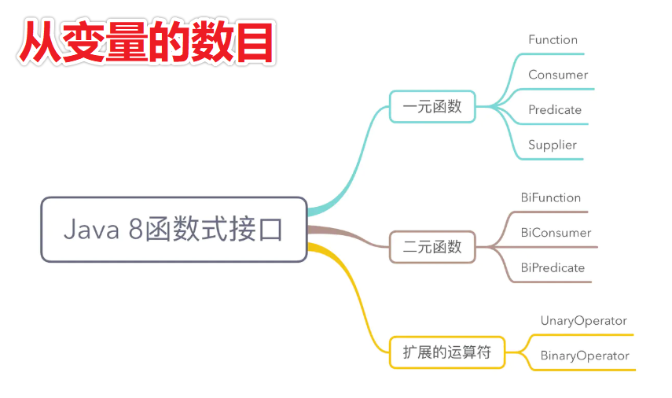
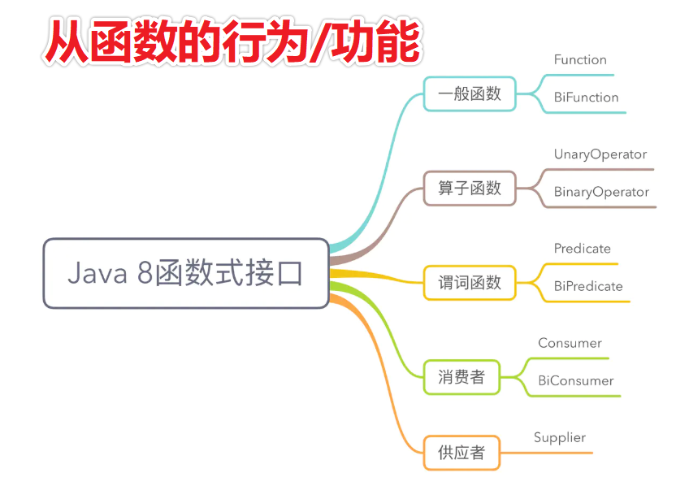

# Lambda 学习记录

使用 3 个 函数式接口 Functional~Interface   对操作进行抽象

## Consumer< T >             void  		  accept   (T t)

抽象消费行为

## Function   < T, R >        R        		  apply     (T t)

抽象加工行为

## Predicate  < T >			boolean 	test		(T t)

抽象筛选行为


## 使用案例

在遍历元素的时候使用  Functional~Interface 对各种行为进行抽象

### 对消费行为抽象，用户决定不同的打印方式（消费行为之一）

```java
public void consume(List<T> list, Consumer<T> consumer) {
    for (T element : list) {
        consumer.accept(element); // 抽象消费行为
    }
}

/* 消费数据（打印）*/
helloLambda.consume(
    // 进来的数据
    Arrays.asList("huan", "huan_huan", "huan"),
    /*
    1 先写 ()-> ,左参 右返回
    2 照着 Consume.accept() 原型的要求 填充 参数 和 语句
    void accept(T t);
    */
    (String i) -> System.out.println("λ 的神奇 " + i)
);
```


### 对转换行为抽象，用户决定对数据的加工

```java
public List<R> map(List<T> list, Function<T, R> f) {
    // 类型 R
    List<R> newList = new ArrayList<>();
    // 类型 T
    for (T element : list) {
        newList.add(f.apply(element)); // 抽象加工行为
    }
    return newList;
}

List<Integer> listOfapply = helloLambda.map(
    // 进来的数据
    Arrays.asList("huan", "huan_huan", "hello world"),
    /*
    1 先写 ()-> ,
    2 照着 Fuction.apply() 原型的要求 填充 参数 和 语句
    R apply(T t);
    */
    (String i) -> i.length()
);
```

### 对筛选行为抽象，用户决定对数据的处理谓词

```java
public List<T> filter(List<T> list, Predicate<T> predicate) {
    List<T> newList = new ArrayList<>();   // 存储筛选出来的元素
    for (T element : list) {
        if (predicate.test(element)){   // 抽象筛选逻辑
            newList.add(element);
        }
    }
    return newList;
}


/* 筛选数据 */
List<String> listAfterFilter = helloLambda.filter(
    Arrays.asList("ain","huan", "huan_huan", "huan","xin"),
    /*
    1 先写 ()-> ,
    2 照着 Predicate.test() 原型的要求 填充 参数 和 语句
    boolean test(T t);
    */
    (String element)->element.startsWith("a")
);
```

## 评价

用户在使用的时候，要默认遵守 函数式接口，无需指出函数名，可读性其实并不是很高。

怎么办呢？可以用 方法引用 的技术解决吗？

## 方法引用

### 案例

无参的方法

有参的方法(不太好理解)

构造方法

### 简介

> 思想 
>
> > 如果一个Lambda代表的只是“直接调用这个方法”，那最好还是用名称
> > 来调用它，而不是去描述如何调用它。  
>
> 一言以蔽之
>
> > 某些 Lambda  的快捷写法

### 方法引用类型的设计——解读设计



