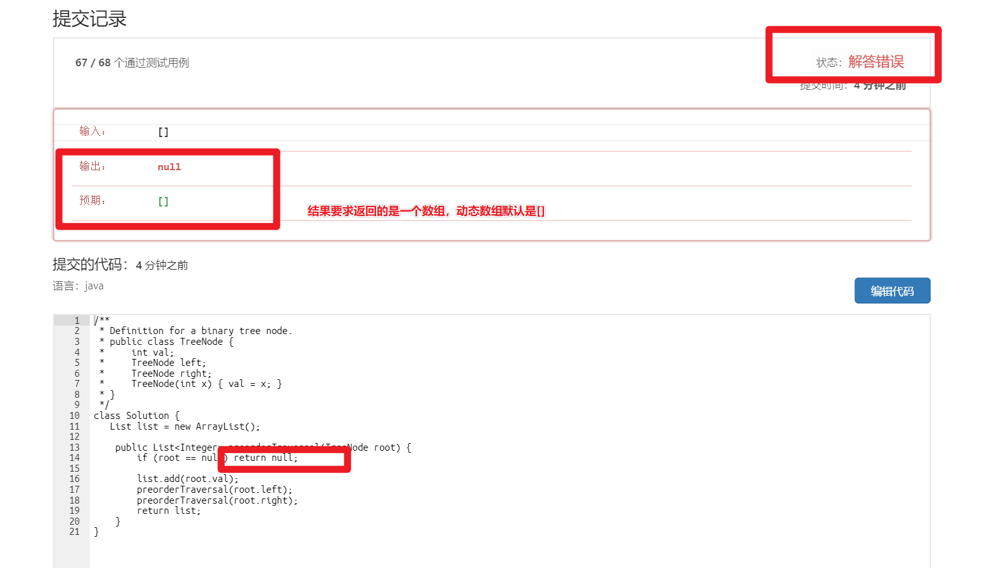
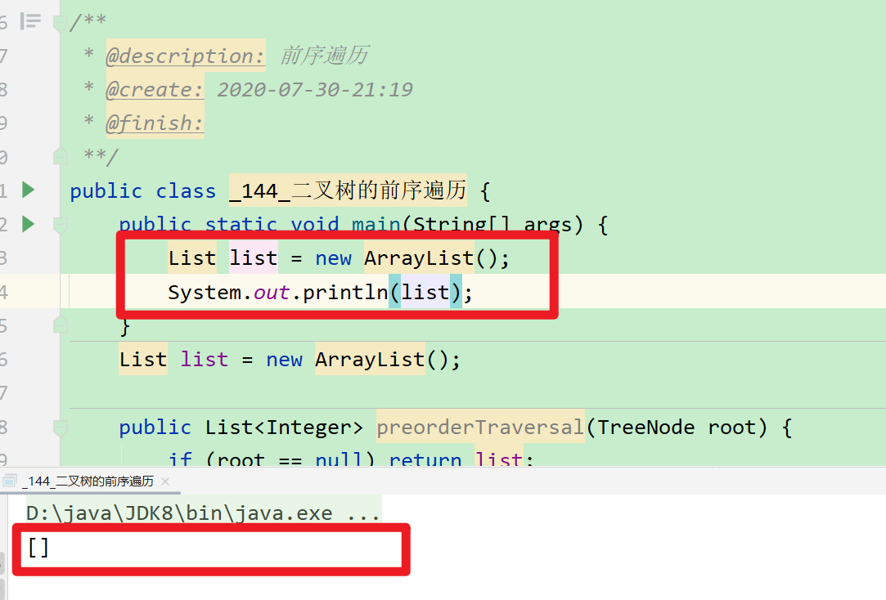
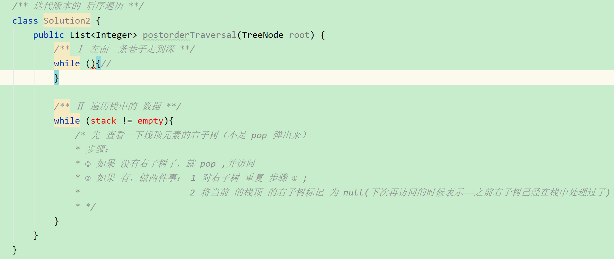
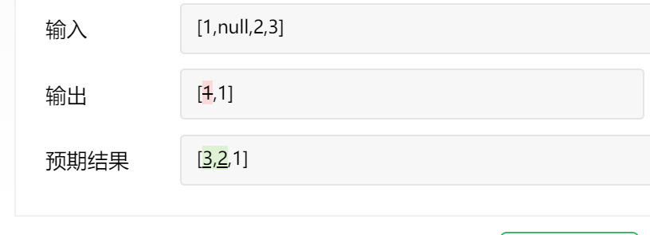
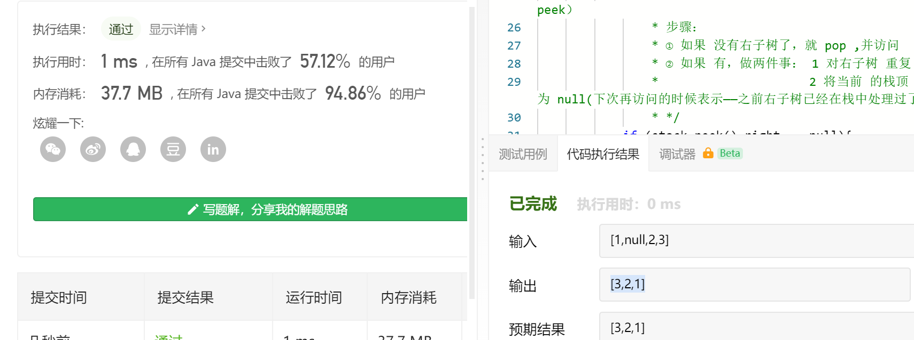
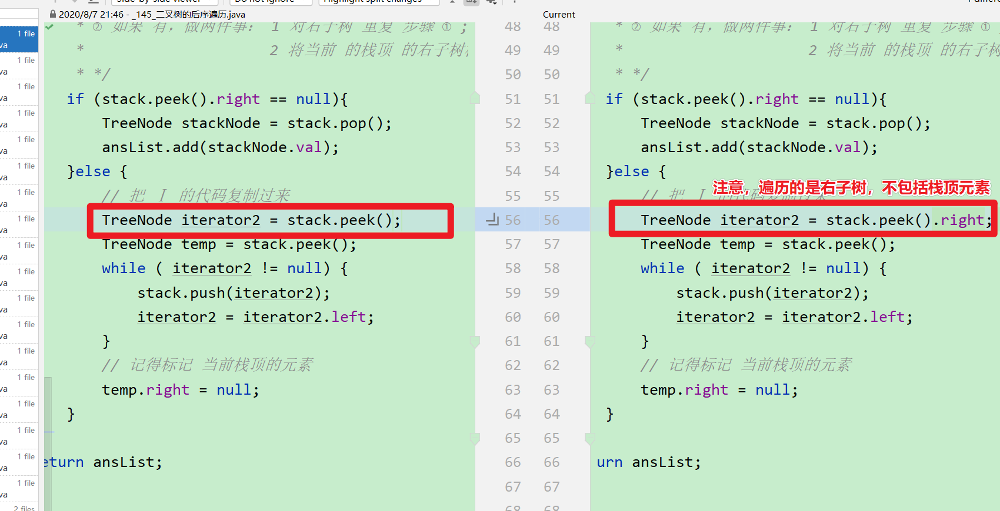
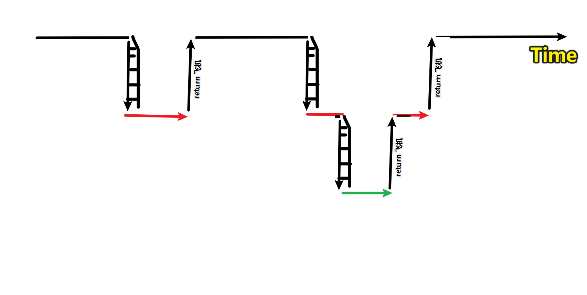

## 遍历的应用

### 总结整理

##### 关于独立思考的思路

> 动手写代码之前，
>
> 先尝试问自己一个问题，我可以复用之前同样的劳动吗？或者可以在此基础上进行调整吗？
>
> 如果可以，就先把框架搭建出来，然后针对具体问题，进行调整逻辑。
>
> 就这道题来说，下午先看了 书上的 前序和中序的迭代遍历的思路（其实就是模拟递归——函数的调用过程——入栈，出栈，而前序遍历和递归过程第一次遇到各个节点的顺序是一致的，中序遍历）。
>
> 算法的设计的正确性首先要用样例进行检查——代入数据，手算检验算法的正确性。
>
> 用自然语言将算法的步骤都要明确下来，用序号 ①②③④ 标好，说人话。
>
> 开始写代码，根据算法步骤 ①②③④  分阶段处理数据，用 熟悉的编程语言表达。
>
> 最后检查细节，是否处理 null, 返回值要求等等。
>
> 尝试用多种思路，至少两种方法写出来，比如递归，迭代。
>
> 然后就是写题解，费曼技巧解释题目，你会发现很多疑点，提出很多问题，把问题整理出来，努力解决。
>
> 还有根关键的一步，就是对比学习别人的代码。
>
> > 同样的思路，别人的代码为什么更精简？如何做到的？
> >
> > 发现了什么更好的思路？

### 问题思考及要求

#### 1 如何解释前序遍历的迭代式算法和非迭代式算法的思想，做到毫不犹豫写出代码？

递归

迭代

#### 2 为什么 中序遍历 和 前序遍历可以使用相同的模板？而后序遍历不行？

#### 3 为什么 递归算法的 3种遍历（前中后）都可以使用相同的递归模板？

### 注意题目返回要求




错误纠正——如果题目要求返回是数组，就用 ArrayList



### 144 迭代实现 二叉树的遍历——前序或者中序

思路

> ① 左边一条巷子走到深。逐个压入栈。
>
> ② 弹出栈顶元素；
>
> ③ 检查 弹出元素是否含有右子树
>
> ​			如果有，继续执行①
> ​			如果没有，继续执行②

实现注意

>前序遍历
>
>压入栈的时候，访问元素
>
>中序遍历
>
>弹出栈的时候，访问元素

#### 优化自己的代码

TODO 代码优化，去掉重复的代码 

#### 学习别人的解法和代码

我是看王道的

核心思想

经典教科书写法

核心思想

>


### 145 二叉树的后序遍历——迭代版本独立尝试

#### 整体思路



#### 独立实现

##### 有问题的

问题如下



```java
public List<Integer> postorderTraversal(TreeNode root) {
    Stack<TreeNode> stack = new Stack<>();
    List<Integer> ansList = new ArrayList<>();

    if (root == null) return ansList;
    /** Ⅰ 左面一条巷子走到深 **/
    TreeNode iterator = root;
    while (iterator != null) {
        stack.push(iterator);
        iterator = iterator.left;
    }

    /** Ⅱ 遍历栈中的 数据 **/
    while (!stack.isEmpty()) {
        /* 先 查看一下栈顶元素的右子树（不是 pop 弹出来, 用 peek）
                 * 步骤：
                 * ① 如果 没有右子树了，就 pop ,并访问
                 * ② 如果 有，做两件事： 1 对右子树 重复 步骤 ① ;
                 *                     2 将当前 的栈顶 的右子树标记 为 null(下次再访问的时候表示——之前右子树已经在栈中处理过了)
                 * */
        if (stack.peek().right == null){
            TreeNode stackNode = stack.pop();
            ansList.add(stackNode.val);
        }else {
            // 把 Ⅰ 的代码复制过来
            TreeNode iterator2 = stack.peek();
            TreeNode temp = stack.peek();
            while ( iterator2 != null) {
                stack.push(iterator2);
                iterator2 = iterator2.left;
            }
            // 记得标记 当前栈顶的元素
            temp.right = null;
        }
    }
    return ansList;
}

```

##### 改正



改正的地方



代码

```java
/**
  * 迭代版本的 后序遍历
 **/
class Solution2 {
    public List<Integer> postorderTraversal(TreeNode root) {
        Stack<TreeNode> stack = new Stack<>();
        List<Integer> ansList = new ArrayList<>();

        if (root == null) return ansList;
        /** Ⅰ 左面一条巷子走到深 **/
        TreeNode iterator = root;
        while (iterator != null) {
            stack.push(iterator);
            iterator = iterator.left;
        }

        /** Ⅱ 遍历栈中的 数据 **/
        while (!stack.isEmpty()) {
            /* 先 查看一下栈顶元素的右子树（不是 pop 弹出来, 用 peek）
                 * 步骤：
                 * ① 如果 没有右子树了，就 pop ,并访问
                 * ② 如果 有，做两件事： 1 对右子树 重复 步骤 ① ;
                 *                     2 将当前 的栈顶 的右子树标记 为 null(下次再访问的时候表示——之前右子树已经在栈中处理过了)
                 * */
            if (stack.peek().right == null){
                TreeNode stackNode = stack.pop();
                ansList.add(stackNode.val);
            }else {
                // 把 Ⅰ 的代码复制过来
                TreeNode iterator2 = stack.peek().right;
                TreeNode temp = stack.peek();
                while ( iterator2 != null) {
                    stack.push(iterator2);
                    iterator2 = iterator2.left;
                }
                // 记得标记 当前栈顶的元素
                temp.right = null;
            }
        }
        return ansList;
    }
}
```

> 


前序和中序的迭代遍历的思路和步骤

>  ① 左边一条巷子走到深。逐个压入栈。push  （前序遍历在此 访问元素 visit）
>
>  ② 遍历栈，逐个弹出栈顶元素；pop    （中序遍历在此 访问元素 visit）
>
>  ③ 检查 弹出元素是否含有右子树
>
>  > 如果有，继续执行①
>  >
>  > 如果没有，继续执行②

后序遍历的思路和步骤

>① 左边一条巷子走到深。逐个压入栈。push
>
>② 遍历栈, 查看栈顶元素  peek  —— 不是前中序的弹出 pop！！！
>
>③ 检查 栈顶元素是否含有右子树
>
>> ① 如果 没有右子树了，就 pop ,并访问
>>
>> ② 如果 有，做两件事： 
>> 	1 对右子树 重复 步骤 ① ;
>>     2 将当前 的栈顶 的右子树标记 为 null(下次再访问的时候表示——之前右子树已经在栈中处理过了)

注

> > ①模拟的是递归**第一次到达递归边界**的左递归过程。（不断下层，不到边界不停止，栈底保存是最开始的现场——盗梦空间的第一层梦境，栈顶保存的是当前下沉到达的梦境）
> >
> > ②模拟的是**第一次递归返回**后的各种操作。
> >
> > > 对于 情况一来说，返回后是没有梦境了的。
> > >
> > > 对于情况二 来说，返回后还有梦境，要继续一直下沉到梦境的边界出现为止。
>
> 
>
> 从函数调用的角度观察
>
> > 可以把函数调用想象成一个在水平面挖爬楼梯下陷到梦境的过程，返回的过程想象成坐return飞机返回现场的过程；
> >
> > 迭代和递归的不同地方：
> > 使用迭代（栈）需要保存各层梦境现场信息;
> > 在使用高级语言，含有递归调用（函数调用的）语言中，使用递归无需去手动维护现场数据。
>
> 这就是递归的一个重要特点（深度优先，一条巷子走到深）
>
> 
>
> 


补充关于递归

| 递归（下坐标为时间，右坐标为函数调用层次的图表示递归） |
| ------------------------------------------------------ |
| 现场                                                   |
| 左递归                                                 |
| 现场                                                   |
| 右递归                                                 |
| 现场                                                   |

从解答树的角度看（TODO）

#### 优化自己的代码

TODO 代码优化，去掉重复的代码 


#### 学习别人的解法和代码

