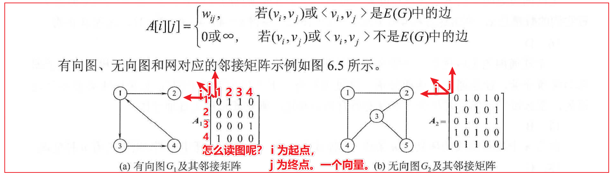
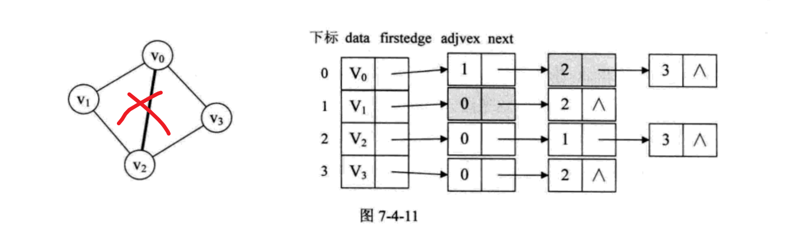

# 图的存储的学习路线

各种存储的缺点：

邻接矩阵：浪费空间

邻接表：找入边不好找

## 图的 4 种存储方式（时间 9.7 日）

### 邻接矩阵

一个有向图，一个无向图，看图就明白了。

### 邻接表 及 逆邻接表

类比树的孩子表示法

### 十字链表（有向图讨论）可以看作有向图的优化存储

思考过程：

开始的时候，那么多线，那么多字段。无从下手

本着先易后难的原则，一点一点逐个突破。

对照着图，首先突破的是边的信息，起点和终点

然后呢，突破实线，也就是顶点的出边（起点相同的点）

最后突破的是顶点的入边

### 邻接多重表

思考过程：

十字链表解决了**有向图**的兼顾出入度的问题。

那么，对于无向图，是否存在同样的优化方法？

邻接表可以方便的解决 点的问题，但是，对于边的的处理，要删除某条边，

涉及到两个顶点（先要找到 两个顶点）的处理如图：

重新设计

第一步，先画出  5 个顶点，4 条边

如何连线呢？

第一步：将顶点和与起点是顶点的边连起来。

第二步 

对 0 号节点线路进行完善，

第一条边是 （0 1）

0 在 ivex 的位置，因此，ilink 要定位到下一条边 （0 3）；

第二条边的 （0 3 ）

0 在 jvex 的位置，因此，jlink 要定位到下一条边 （0 2）；

(0 2) 边之后， 顶点 0 的所有边都已经找到，无需定位，0 在 ivex 的位置，因此 ilink 设置为 空。

其余顶点的边，依次类推。