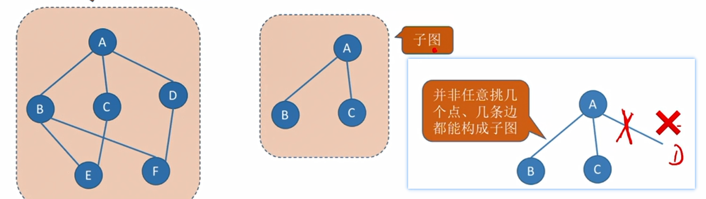
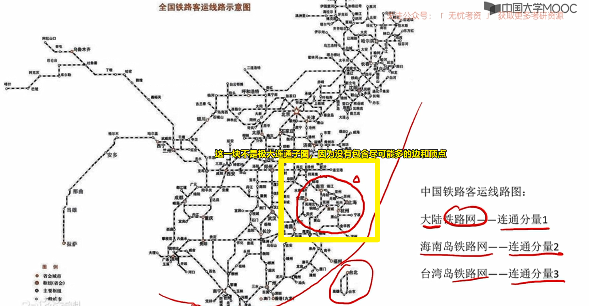
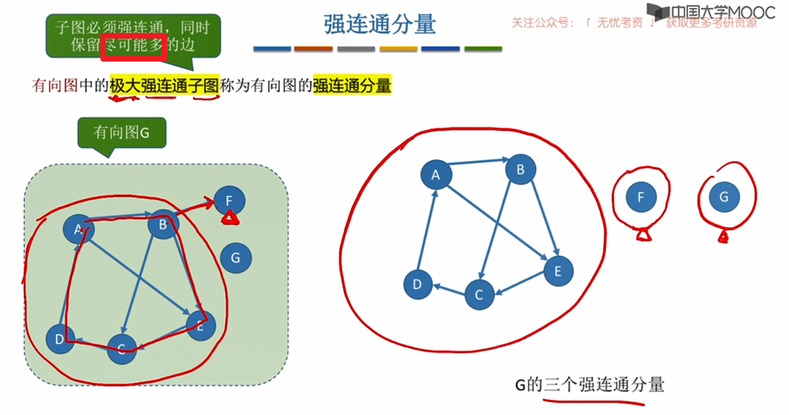

# 图的常用术语

[TOC]

## 子图

从边集和顶点集中 各挑出一个子集，要求边有端点。

eg:

## 生成子图

仅要求包含所有的节点，对边没有要求。

## 连通相关的术语

### 无向图

#### 连通

什么是**连通**？两点之间有路径。

#### 连通图

什么是**连通图**？任意两点之间都有路径。

#### 连通分量 = 极大连通子图的集合

什么是**连通分量**？无向图的**极大-连通子图**。

> 1 划分出来的每个子图都是连通图。
>
> 2 子图要求极大（原图连在一起的点和边一条不能少）

#### 生成树 = 极小连通子图的集合

讨论的前提是——**连通图**

定义是：包含全部顶点的**极小-连通子图**。

> 1 子图包含所有节点，且要连通。
>
> 2 子图包含的**边数最少** （成本最低）
> 	多一条成环，
> 	少一条不连通。

为什么叫树呢？

#### 生成森林

讨论的前提是——**非连通图**

定义是：连通分量的生成树。

补充：

1. 连通分量：无向图的**极大-连通子图**。
2. 生成树：连通图的**极小-连通子图**

> 1 第一步：把非连通图划分为极大连通子图。
>
> 2 第二步：确定每个极大连通子图的极小连通子图。 

#### 最小生成树

对于一颗无向图，生成树可以有很多棵。

如果图中的**边有权值** ，那么，选一颗生成树，使权值之和最小，就是最小生成树。

### 有向图

什么是强连通？任意两个点之间都存在**双向边**。

什么是强连通图？任意两点之间都存在**双向边**。

什么是强连通分量？

> 1 划分出来的子图必须强连通。
>
> 2 子图要求极大（**尽可能多**的保留可以保留的边）

