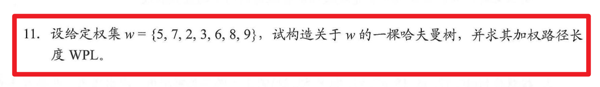
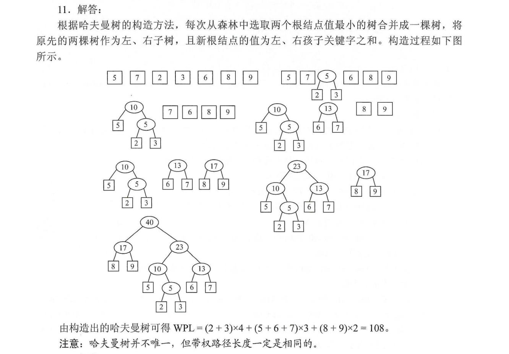

# 哈夫曼编码

## 题目练习

## 答案

## 算法描述

1. 把所有节点独立当作一棵树，按从小到大的顺序排列成一个森林。
2. 挑出最小的两棵树，合成一棵新树，值为最小的两颗树的和。删除掉从森林中选出的两棵树，将新合成的树按大小顺序插入到森林中。（当出现重复元素的时候，构造的哈夫曼树是不唯一的，但是权值不变）
3. 重复 1 2 ，直到森林中仅剩一颗树。

## 代码实现

TODO

