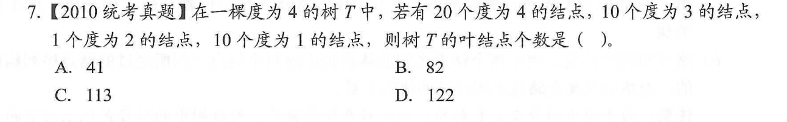

# 树的常用性质

## 数字特征 1 

假设 度为 0 1 2 的结点的个数分别是 N0  N1  N2 

观察角度，首先，节点的总数 N = N0 + N1 + N2

其次，从另外一个角度考虑节点的总数，就是发现除了根节点外，基本每个节点头上都有一根草（哈哈哈，不是绿色的） 。那么这个草在树里面叫什么呢，就是节点的度（在树中，度指的是射出的分支数）。因此，只要计算出所有节点的度之后，然后再考虑上根节点，也就算出了节点的总数。即 N = N1 + 2N2

综上：

1. N = N0 + N1 + N2
2. N = N1 + 2N2 + 1

由此可以推出一个很常用的结论：

N0 + N1 + N2 = N1 + 2N2 + 1

即  N0 ~~+ N1~~ + N2 = ~~N1 +~~ 2N2 + 1

移项后

 N0 ~~+ N1~~  = ~~N1 +~~ N2 + 1

 **N0 = N2 + 1**

度为 0 的节点个数   =  度为 1 的节点的个数  + 1.

课外练习——活学活用

答案：B

