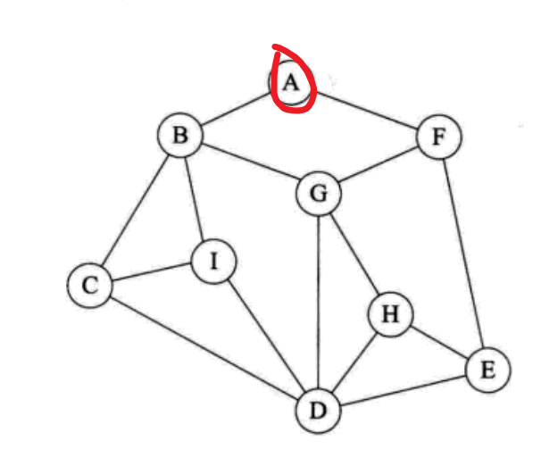
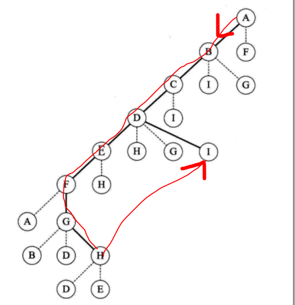
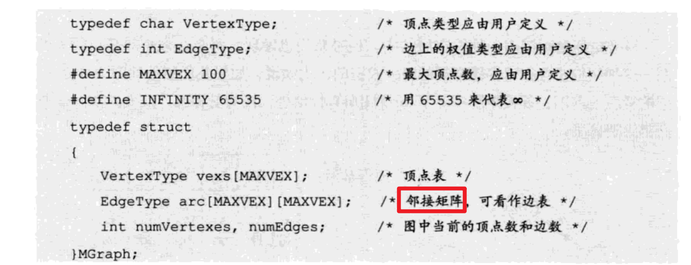
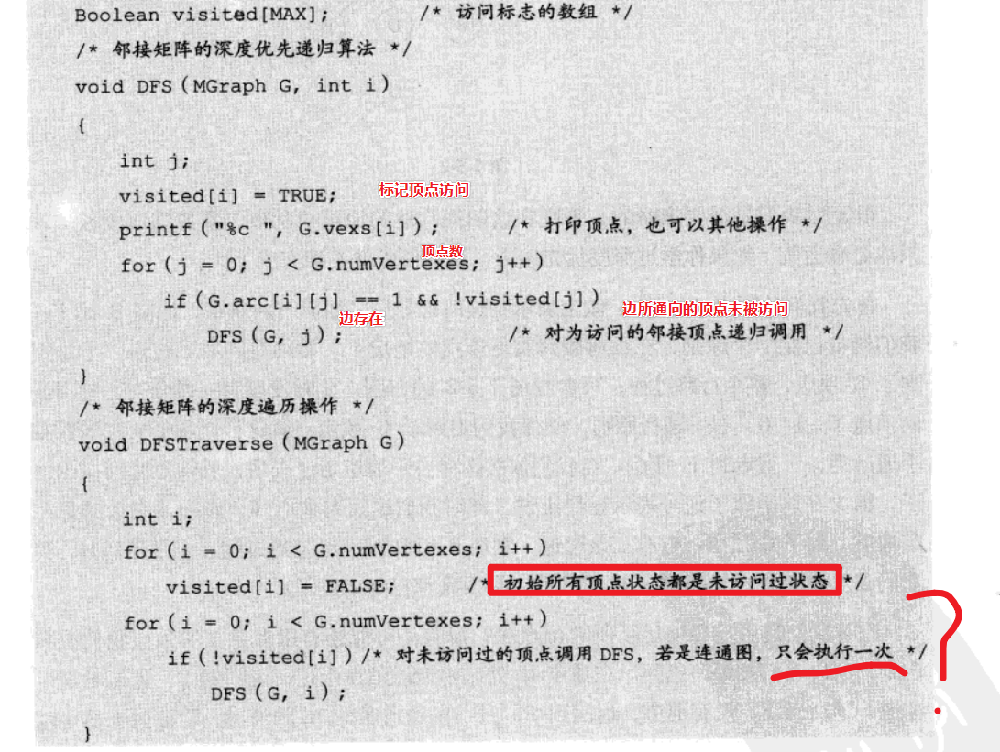
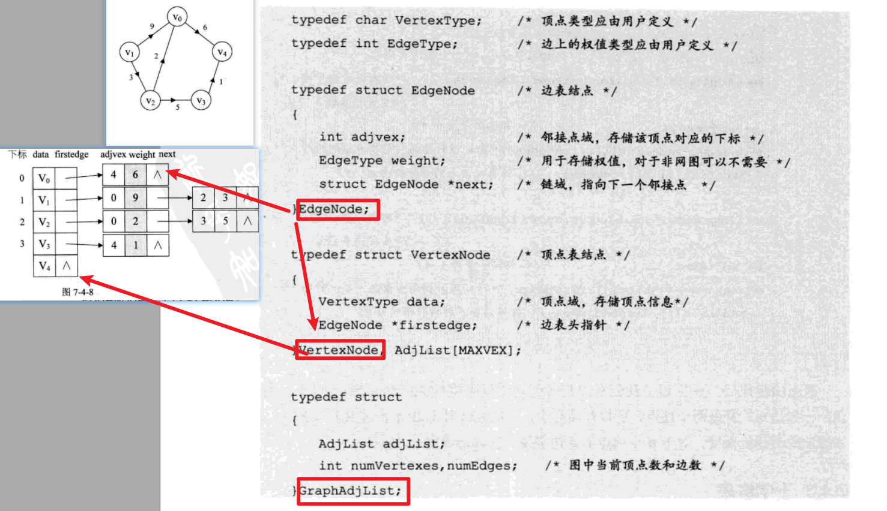
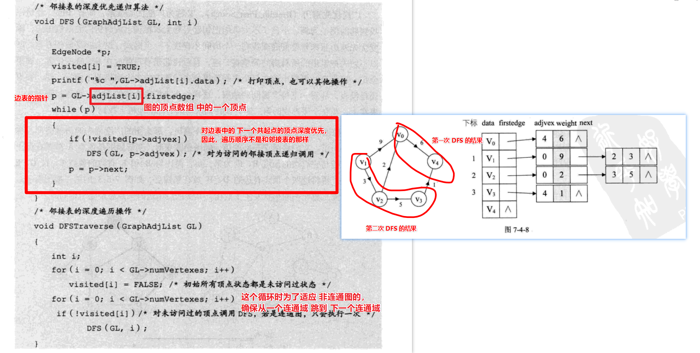
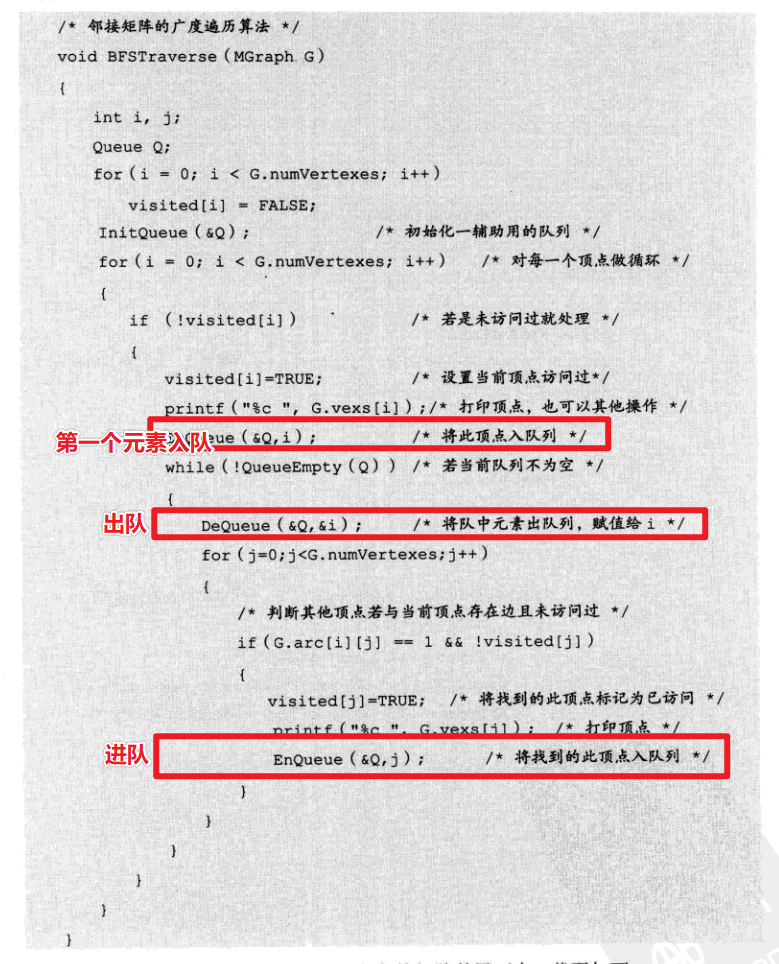
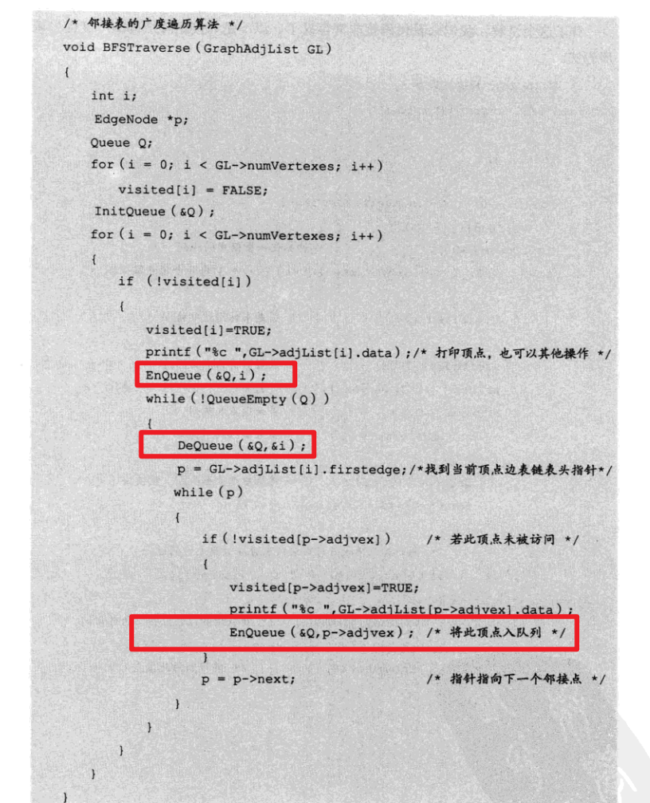

# 图的遍历

## 深度优先 DFS

类比：树的前序遍历。

玩一个游戏——走迷宫

任务：从顶点 A 开始 走遍所有的顶点

规则

1. 没有碰到重复顶点的时候，一直右手通行原则（一定要把你自己想象成走迷宫的人，你正在前行的方向的右手方向），并且记下来你所走过的所有结点。
2. 如果碰到重复顶点，立即原路返回，然后呢？
   继续右手通行原则，检查一下是否有可走的路线——
   如果有，重复 1 2，
   如果没有，那么，继续原路返回。
3. 直到所有的节点都访问完毕。

答案：

简单看一下代码：

图适用什么存储结构呢？

情形 1 ：使用邻接矩阵

邻接矩阵的定义

基于邻接矩阵的深度优先遍历实现

​	

情形 2 ：使用邻接表

邻接表的定义

说明：

图 GraphAdjList 中存储的是 顶点表（一个数组），

每次深度优先遍历，都从数组中取出

基于邻接表的深度优先遍历

## 广度优先 BFS

类比：树的层序遍历。

当时树的层序遍历使用的队列。直接做一道题目手算一下。

TODO 

思考一个额外的 问题：如何利用 层序遍历统计二叉树的高度？如何知道一层遍历完了？之前其实思考过的，每一层记住每一层的个数，当此层遍历完了之后，就更新为下一层的数目。（一层的元素遍历完了之后，队列中的元素数目就是下一层的元素的数目）。

### 实现

思考过程：

1. 第一个放入队列的元素是谁？（用户指定）

2. 取出队列的元素后，要放入队列的中应该是那个东东？（实现难点）

   应该是与取出的元素相关联的顶点。

   

#### 基于**邻接矩阵**的图的    BFS 的实现

整体逻辑

局部细节——难点（如何将取出元素的孩子入队？）

基于**邻接表**的图的 BFS 的实现

整体逻辑

局部细节——难点（如何将取出元素的孩子入队？）

