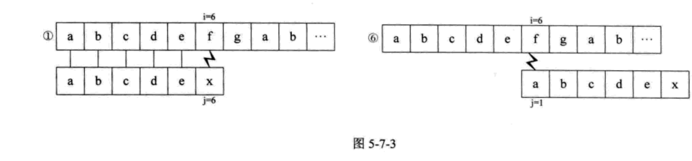
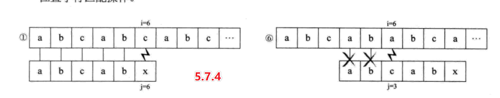
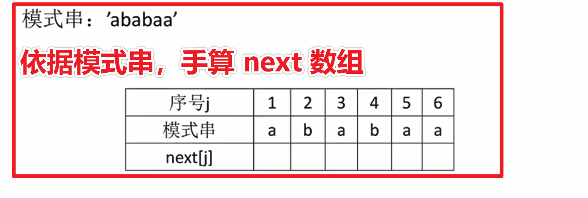
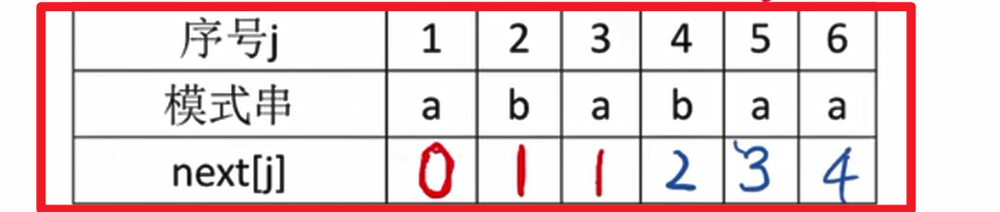

# 模式匹配算法

模式——要匹配的子串

## 暴力模式匹配

算法对象

1. 主串
2. 子串

算法操作

1. 从主串的第一个字符开始，和模式的第一个字符进行比较
2. 如果相等，则继续比较后续字符
3. 如果不相等，则从主串的下一个字符开始，重新和模式的字符进行比较
4. 以此类推，直至模式 T 中的每个字符依次和主串中的一个连续字符序列相等，则匹配成功

## 暴力匹配的问题 VS KMP 算法的思想

暴力的问题

子串如何滑动？

> 记号：
>
> A：主串“前面相等的匹配序列”   
>
> B：模式前面的序列
>
> 
>
> 观察一下模式 **自身的对比** 规律
>
> 如果模式后面的所有字符都和 **模式的第一个字符** 不同，没有可比性；——自身没有可比性，直接跳到模式第一个字符，再与主串比较。
>
> 
>
> 如果模式后面有一段字符和模式前面的一段完全相同，对于相同的，没必要重复和自己比较，模式直接跳到相同部分的下一个字符，然后和主串比较。
>
> 

## 手算 next 数组

### next 数组存储的信息

1. 下标默认对应的是子串的下标。

2. 数组中存储的内容——当子串在该下标不匹配时，子串的指针要跳转的位置。

   

### 检验是否掌握的题目练习（手算）

答案

### 手算的目的要明确

分析：

要算什么？定位到子串的指针要跳转的位置。

1. 先要计算字符串的前后缀最长匹配长度。（除去当前字符前面的字符串）
2. 最长匹配长度 + 1  = 指针的位置。

备注：

第一个位置默认填 0；

第二个位置分析实例：除去当前字符，仅剩下一个字符，依据前后缀的概念可知，前后缀均为空集，所以前后缀的长度为 0，加 1 后得到指针的位置为 1。

算法：

1 第一个位置填 0 

2 第二个位置填 1

3 其余位置手算得到指针位置，公式是： 指针位置 = 前后缀最长匹配长度 + 1。

### 概念要清晰

1. 字符串前缀

   不包含最后一个字符的火车头。（从第一个字符开始的连续子串）

2. 字符串后缀

   不包含第一个字符的火车尾。（结尾必须是最后一个字符的连续子串）

## next 数组优化