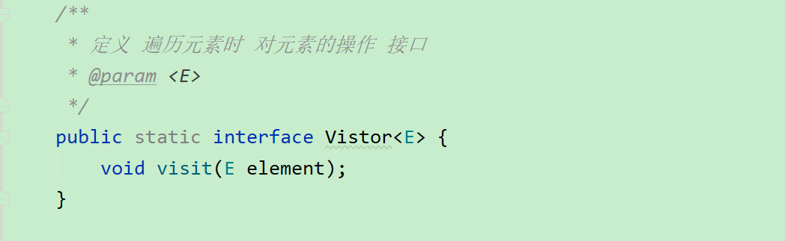
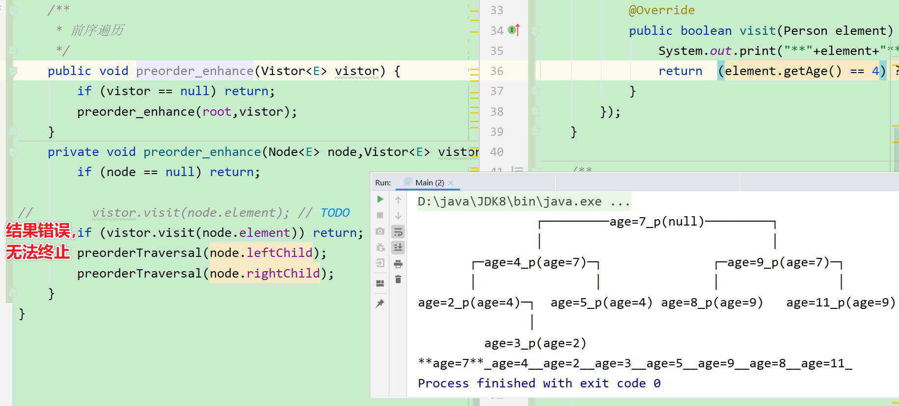
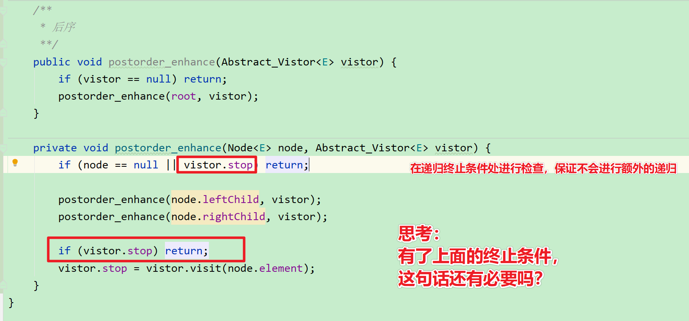
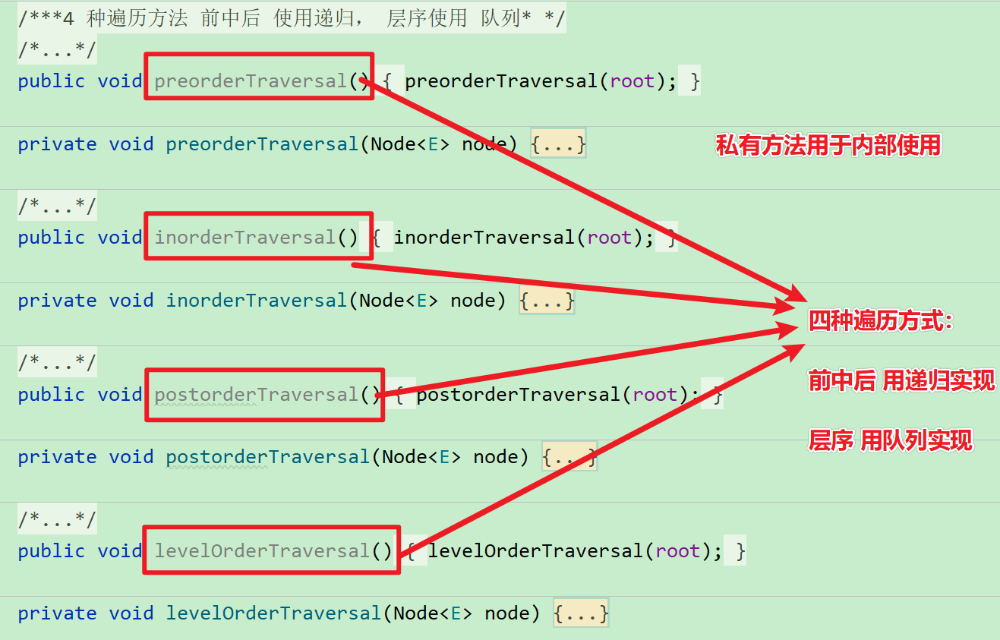
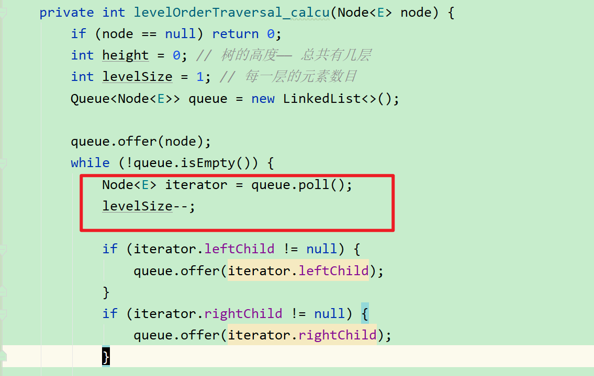
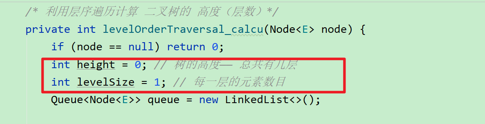

#  BinarySearchTree

[TOC]


## 编辑说明
1 复制 txt 未实现的接口

2 设计 ADT

3 实现 节点的比较函数 compare —— 使用 Comparator 结合 Comparable 

4 设计 打印二叉树的功能——实现 print 工具中的 BinaryTreeInfo 接口 的四个函数

5 实现二叉树的 4 种遍历(树的遍历是可以通用！)

1. 前序 PreorderTraversal 
2. 中序 InorderTraversal
3. 后序 PostorderTraversal
4. 层序 LevelOrder Traversal

> 说明：对于每个方法，额外添加了一个 private 修饰的 (仅供内部使用的)有参的 同名方法，专门给无需传参 的 public接口 调用。

6 重构二叉树的遍历接口——目的是用户在每次遍历节点的时候，可以按照用户需求对节点处理（而不光光是打印节点那么死板）——使用到了类似 Comparator 的设计思想——面向接口编程（在要对数据进行处理的地方，使用接口的方法而不是具体的方法，通过接口的参数将数据传给用户，让用户对数据处理进行决策）

7 增强遍历接口，实现可以遍历到指定节点便终止程序的功能。

8 不使用工具类打印树状二叉树（不依赖外界，直接在内部实现）

9 实现寻找前驱节点的功能

10 实现寻找后继节点的功能

11 实现删除节点的功能

## ADT
### 数据类型
```java
public class BinarySearchTree<E> {
    private int size;
    private Node<E> root;

    private static class Node<E> {
        E element;
        Node parent; 
        Node leftChild;
        Node rightChild;
    }
}
```
### 操作

#### 编辑顺序

##### 1 考虑传入元素为 null ,编写 elementNotNullCheck(),不允许节点为null

##### 2 编写 add()

1. 既然添加元素 ，先 size ++

2. 先添加第一个节点—— root

    > 思路：
    >
    > root 节点的值为 参数值，root 没有 父节点

3. 添加其他节点

    > 思路：
    >
    > 1  先找到他 所属的父节点
    >
    > > 思路：
    > >
    > > 遍历树的节点，和已有的树的节点的值进行比较 ，通过比较记录往什么方向插入节点，同时记录父节点
    > >
    > > ——需要实现  节点值比较的函数，compare 先暂留 当作函数调用，把主要逻辑弄完，一会在再写
    >
    > 2  创建 节点
    >
    > 3 和父节点建立 父子 关系
    >
    > (编写的时候的，需要数据结构是由 后面的内容确定的，所以代码不是从上往下写的——读代码的时候要注意这个问题，先找核心逻辑，再分析数据)

##### 4 实现通用的 遍历方法（所谓的“序”说的是根 ）

1. 前序遍历(Preorder Traversal)
    优先根节点， 根——左——右
    
    实现方式，递归
    
2. 中序遍历(Inorder Traversal)

    根排第二，     左——根——右

    > BST 的中序遍历后的结果 刚好是升序排序/降序排序的

3. 后序遍历(Postorder Traversal)

    根排第三，     右——左——根

4. 层序遍历(LevelOrder Traversal)

    > 提示：使用 队列的方式实现。
    >
    > 如何实现呢？（或者说算法步骤是什么？）
    >
    > 1 将根 root节点放到 队列
    >
    > 2 取出根节点
    >
    > 3 将 根的 left 和 right 分别放入队列
    >
    > 4 重复 2 -3 步骤
    >
    > 
    >
    > Java 的队列的相关知识：
    >
    > 队列 再 Java 中仅仅定义的是一个接口，实例化的时候，用 LinkedList 进行实例化。
    >
    > 
    >
    > 2 Queue 接口的方法名字有些特殊：
    >
    > > 1 enqueue（入队）—— offer
    >>
    > > 2 dequeue（出队）——  poll (削)
    > >
    > > 3 front（取队头） ——   peek
    > 
    > 
    >
    > 

##### 5 重构遍历接口——用户自定义拿到遍历到每个节点后的处理逻辑

原因：原来的代码，用户只能使用写死的处理节点逻辑，无法自定义节点处理逻辑。

对比：


> 面向接口编程
>
> 1 定义处理节点逻辑的接口（由于这个和二叉树关联比较大，直接在 二叉树内部定义接口 ）
>
> 接口方法，将数据作为参数，交给用户处理
>
> 
>
> 2 如何使用接口方法
>
> > 1 需要灵活处理的地方，使用接口方法，而不是具体的方法
> >
> > 2 用户 在使用方法的时候，具体实现接口方法
> >
> > 

##### 6 继续增强遍历接口——需求——不遍历所有节点，按需遍历到指定节点就终止

1. 如果想遍历到某个元素就结束遍历，如何实现？

> 问题明确：
>
> > 当发现指定元素后，后面的都不输出，最好直接终止程序。
>
> 具体分析：
>
> > 对于层序遍历（迭代实现），在通过 接口 进行操作元素的位置，对用户的输入进行判断，如果用户显式的将 接口的方法的 逻辑值  指定为 ture (java 默认返回 false)，就中断程序。
> >
> > 
> >
> > 要区分 2 个概念：
> >
> > ——1虽然表面不打印，但实际程序没终止（治标不治本）
> >
> > ——2 不光表面不打印，而且实际程序也终止了（标本兼治）
> >
> > 如果要标本兼治，就需要考虑如何终止递归，既要在递归终止条件处 下手。
>
> 
>
> 具体实现：
>
> 层序遍历（迭代实现）
>
> >
> >
> >
>
> 前中后序遍历（迭代实现）
>
> >对于前中后序（递归实现），是否可以使用像之前  层序遍历 那样的判断实现需求呢 ？
> >
> >先看解决方式 1：
> >
> >
> >
> >问题：
> >
> >
> >
> >思考 1  ：上述为什么不可以？
> >
> >> 你想，每次遍历使用的  vistit 方法返回的都是自己的 布尔值，不是全局共用的，自然，上次的设置或者说修改对下次是不可见的。我们的目的是能记录上次的状态！因此需要一个可以共用的数据。
> >
> >
> >
> >思考 2 ：如何将 上次的  boolean 值保存起来？
> >
> >> 思路  1
> >>
> >> 在方法外面额外定义一个全局变量吗？
> >>
> >> 那有  4  个遍历方法，岂不是要定义 4 个变量？
> >>
> >> 不可行。
> >>
> >> 
> >>
> >> 思路  2
> >>
> >> 一次递归中，所有子递归都不断往下传一个相同的数据——Vistor,因此可以在这个数据上动手脚。
> >>
> >> 
> >>
> >> 能否直接在 接口 Vistor 中定义一个 成员变量呢？
> >>
> >> 不能，按照 Java 语法：
> >>
> >> ——接口中可以定义成员变量，
> >>
> >> 但是，默认修饰符 **public static final**  ，
> >>
> >>  final 的含义是—— 只可赋值一次。
> >>
> >> 因此不满足要求，
> >>
> >> 
> >>
> >> 因此，不可行。
> >>
> >> 
> >>
> >> 思路 3
> >>
> >> 既然，接口不行，那就用 和接口类似的，但是可以存放**可修改的**成员变量的 抽象类
> >>
> >> 
> >>
> >> > 问题：
> >> >
> >> > 对于前序遍历，判断出现在前面，如果一旦出现 值为 true ，后续递归就终止执行。
> >> >
> >> > 
> >> >
> >> > 但是，对于后续或者是中序遍历，只是终止了打印逻辑，并没有终止后续所有的递归。
> >> >
> >> > 配图：
> >> >
> >> > 
> >> >
> >> > 
> >> >
> >> > 
> >> >
> >> > 解决方式:在递归的终止条件处做文章
> >> >
> >> > 
> >> >
> >> > > 思考答案：
> >> > >
> >> > > 有必要。
> >> > >
> >> > > 原因：上面的那句检查代码的作用是负责终止后续节点的递归。
> >> > >
> >> > > 可以这样想，如果没有下面的语句会怎样？——如果没有，假设找到了目标节点，下次调用递归的时候，会直接终止返回，然后执行下面的语句，如果这里没有语句进行控制，那么，就会遍历当前的节点，导致输出多了当前目标节点。
> >> > >
> >> > > 
> >> > >
> >> > > 启发：
> >> > >
> >> > > 如果我是单纯的想终止递归到某个节点（不包括该节点），直接在递归调用处做文章即可，

##### 7 实现最基本的遍历所有节点的功能，不依赖外界工具

自己尝试写：开始其实思路不清就动手了，编程应该是逻辑必须先想清楚，然后才是去快速实现验证，而不是连自己的逻辑都搞不清的情况下胡思乱想。


可以按序打印节点信息，但是不直观


最基本的且是直观的打印所有节点


再理解


##### 8 前驱节点

前驱节点的概念

> 中序遍历的前一个节点。

对于二叉搜索树，找给定节点的前一个节点，就是找他的左子树的最大的节点，但是，如何找呢？

> 思路
>
> 遍历左子树，记录最大的节点——其实没必要比较，二叉搜索树默认是按顺序排好的。因此只要找到左子树最右边的元素即可。 （对于其他二叉树，同样成立，因为左子树最右边的那个元素刚好是中序遍历的前一个节点）

如果左子树为 null ? 怎么处理？如图：假设 6 的左子树为 null。

左子树为null ，则前驱节点是父节点——4。

但是对于节点 9 其前驱并不是父节点


辅助用图（对于节点 9 其前驱并不是父节点）


对于左子树为 null 的情况的处理：如图中的 节点 9。

> 思路是：找父节点，且是父节点的右子树（比父节点大）

如果 左子树为 null, 父节点也是 null 如何处理？

> 没有前驱。 
>
> 比如 1 号节点。


思想

> 中序遍历——左根右的顺序——对于任意一个节点来说，有前驱节点有两种可能，
>
> 1 有左子树
>
> 2 有根，且位于根的右侧，因为根要先于右节点遍历

算法

> 如果左子树不为 null, 就找到左子树最右边的节点；
>
> 如果左子树为 null
>
> > 判断是否有父节点
> >
> > 如果没有，就没有前驱节点；
> >
> > 如果有
> >
> > > 找一个最近的父节点，要求当前元素所在的树在这个父节点的右侧
> > >
> > > 如果找不到，就没有前驱节点
> > >
> > > 如果可以找到，则最近的父节点即为 当前元素的前驱节点。 

##### 9 后继节点

>中序遍历的后一个节点。

分析

> 对于一个节点，有后序节点的可能
>
> 1 有右子树
>
> 2 有根，并且位于根的左侧

算法

> 和前继节点思路一致，代码是对称的，只需将 左子树的操作改为右子树，将根的右侧改为左侧

##### 10  实现删除节点的功能

思考

> 将删除的节点按照度分为 叶子节点，度为 1 ，度为 2 的节点
>
> 度为 0， 直接删除；
>
> 度为 1 ，找到父节点，将子交给父，即用子取代；
>
> 度为 2 呢？
>
> > 不能直接删除，而是要从 左/右子树中找一个元素进行替代。
> >
> > 要保持二叉搜索树的性质！应该**从左子树中找最大的**OR **从右子树中找最小的**。
> >
> > 复用之前的努力
> >
> > 从左子树找 最大前驱
> >
> > > 找最右边的，最后度只能为 1 或 0，因为如果度为2 ，会继续往右找
> >
> > 从右子树找 最小后继
> >
> > > 找最左边的，最后度只能为 1 或 0

实现

> 用户传进来的是具体的数据，程序操作的是节点，因此首先要找到数据对应的节点。
>
> 1 编写一个根据元素查找结点的函数 node()
>
> > 利用二叉搜索树的有序性进行遍历。不需要是用常规的遍历方法。
>
> 


## 细节处理

遍历节点的时候遇到相同值的元素怎么处理？是选择什么也不做吗？这样有问题吗？


> 解决方法：使用覆盖的方式，原因，如果数据的属性不止一个，比如，Person 还有名字，如果添加了 两个 10 岁的Person ,但名字不一样，如果后面的是应该覆盖掉前面的，代码就要调整一下。


为什么对于遍历的方法，都要设计两个方法？一个 public , 一个 private ? 

> 别人的写法：
> 遍历 用到了root , public 方法将 root 作为实参 传给 private 方法
>
> 思考：
> 我完全可以 直接 将全局数据 root 不用传参的方式使用，就和 size() 方法一样，那为什么还要这样写呢？多此一举吗？ TODO


方法多了，别弄错了


## 接口，命名说明（可能存在问题，比较仓促）

### 项目结构说明


### BST 类型说明


### 接口说明



### 设计说明


## 应用

### 二叉树遍历的应用

#### 1 通过层序遍历（队列实现），计算二叉树的高度（可以单独抽取一个子问题，就是实现计算二叉树某一层节点的个数，这样就对层序遍历有更深入的认识）

> 思想：遍历完一层，高度加 1 ，只有根节点的情况约定为 1 层。
>
> 用到的辅助算法与数据： 
>
> > 1. 层序遍历
> >
> >    > 层序遍历（队列实现）的关键特点：
> >    >
> >    > 每层遍历完了之后，下一层的数目刚好是队列中元素的数目。可以方便的判断是否遍历完一层。
> >
> > 2. 高度计数器 height  
> >
> > 2. 每层元素统计器 levelSize
>
> 如何维护数据（要结合层序遍历的算法）：
>
> > 1 height 和 levelSize在 层序遍历的 什么地方进行维护呢？
> >
> > > 这样想：开始时 levelSize 对应的层有 levelSize 个元素，遍历这层元素的时候，每遍历一个，这层的元素数目减 1，(levelSize --)
> > >
> > > 
> > >
> > >   等待元素出队并且将左右节点放入队列后，(目的是为了确保这层元素遍历完了之后，在统计下一层元素数目的时候，下一层的数据已在队列中准备好)
> > >
> > > 
> > >
> > > 然后检查这层的元素是否 遍历完，如果遍历完了，做两件事，1 统计层数（height ++） 2 更新下一层的 元素数目。(levelSize = queue.size())
> > >
> > > 
> >
> > 2 对于 height
> >
> > > 初始值为 0（如果没有节点，高度为 0；只有根节点，高度为 1）; 
> > >
> > >  levelSize 每减到 0（遍历完一层），height 计数 1 次。
> >
> > 3 对于 levelSize
> >
> > > 初始值记为 1（第一层有 1 个元素——root） ; 
> > >
> > >  levelSize 每减到 0（遍历完一层），更新 levelSize 为当前队列 Queue 的长度 queue.size() 。
> >
> > 

#### 2 完全二叉树的判断

思路

> 层序遍历每个节点，对于节点，有 4 种可能：（0 代表 null），处理逻辑如下：

| 节点左右子树情况 | 处理逻辑               |
| :--------------: | ---------------------- |
|        00        | 要求后续节点为叶子节点 |
|        01        | 不符合要求，返回 false |
|        10        | 要求后续节点为叶子节点 |
|        11        | 加入到队列，不做处理   |

层序遍历模板

```java
private void levelOrderTraversal(Node<E> node) {
    if (node == null) return;
    Queue<Node<E>> queue = new LinkedList<>();

    // 1 将根 root节点放到 队列
    queue.offer(node);
    while (!queue.isEmpty()) {
        // 2 取出 队首元素
        Node<E> iterator = queue.poll();
        /*自定义层序遍历处理元素的逻辑*/
        System.out.print("_" + iterator.element + "_");

        // 3 将 根的 left 和 right 分别放入队列
        if (iterator.leftChild != null) {
            queue.offer(iterator.leftChild);
        }
        if (iterator.rightChild != null) {
            queue.offer(iterator.rightChild);
        }
        // 4 重复 2 -3 步骤 while 实现
    }
}
```

代码实现

```java
private boolean levelOrderTraversal_isCompleteTree(Node<E> node) {
    if (node == null) return false;
    Queue<Node<E>> queue = new LinkedList<>();
    boolean isLeaf = false;

    queue.offer(node);
    while (!queue.isEmpty()) {
        Node<E> iterator = queue.poll();
        /*自定义层序遍历处理元素的逻辑*/
        if (isLeaf && !isLeaf(iterator)) return false;

        if (iterator.leftChild != null) {
            queue.offer(iterator.leftChild);
        } else if (iterator.rightChild != null) { // 01
            return false;
        }

        if (iterator.rightChild != null) {
            queue.offer(iterator.rightChild);
        } else { // 10 00 要求后续节点是 叶子节点
            isLeaf = true;
        }
    }
    return true; // 队列已经遍历完毕，没有有问题的节点
}
```

如何验证正确性 ？

> 手动填充完全二叉树数据验证：
>
> 按照层序遍历的顺序将树绘制出来，然后对应的层序遍历序列即为满二叉树的构造数据。
>
> eg:
>
> ```
> // 如果想得到一个目标二叉树，就按层序遍历的顺序将其添加到数组中
> //        7
> //     4    9
> //   2  5  8  11
> // 1
> 
> 7 4 9 2 5 8 11 1
> ```
>
> 
>
> 随机生成数据验证：
>
> ```java
> for (int i = 0; i < 10; i++) {
>        bst.add((int)(Math.random()*100));
> }
> ```

####  3 翻转二叉树（所有子树）


思路

> 遍历每一个节点，然后它的左右节点。

实现

> 各种遍历都可以

代码实现

> ```java
> public TreeNode invertTree_AC(TreeNode root) {
>        if (root == null) return null;
> 
>        Queue queue = new LinkedList();
>        queue.offer(root);
> 
>        while (!queue.isEmpty()) {
>            TreeNode iterator = (TreeNode) queue.poll();
>            // 交换节点
>            TreeNode temp = iterator.left;
>            iterator.left = iterator.right;
>            iterator.right = temp;
> 
>            if (iterator.left != null) {
>                queue.offer(iterator.left);
>            }
>            if (iterator.right != null) {
>                queue.offer(iterator.right);
>            }
>        }
>        return root;
> }
> ```


