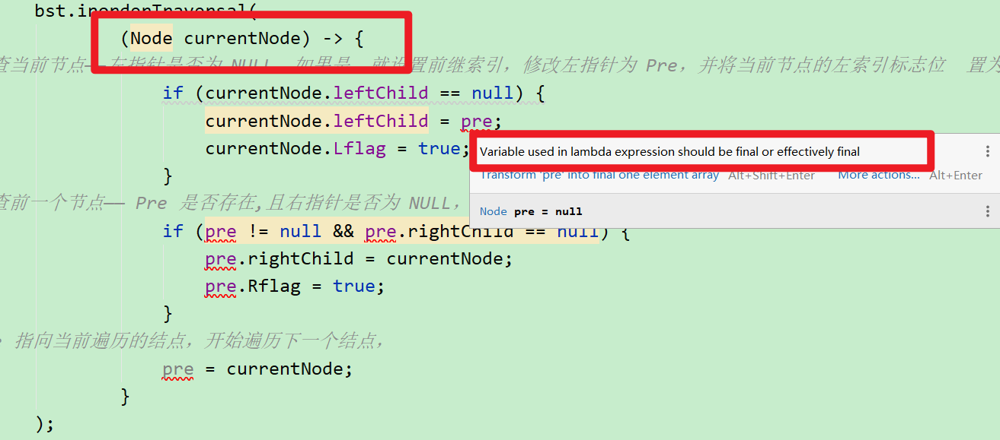
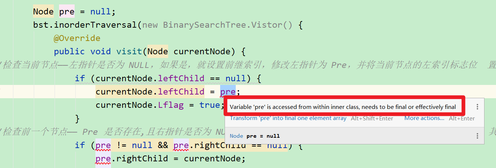
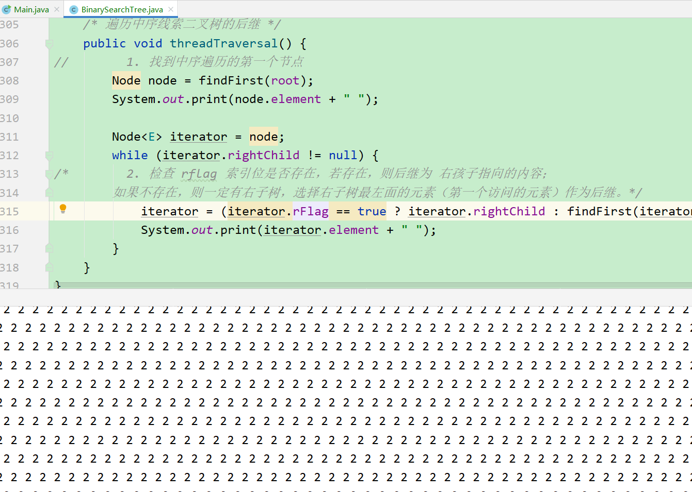
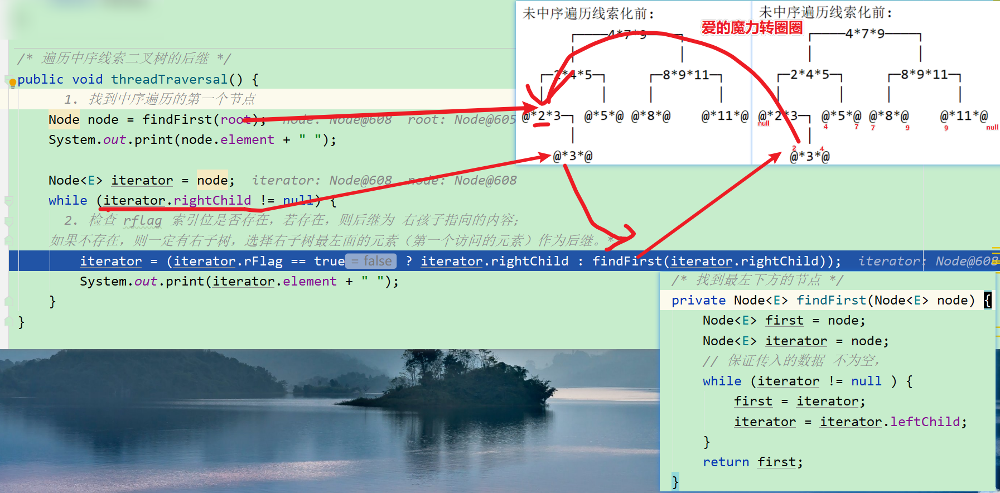
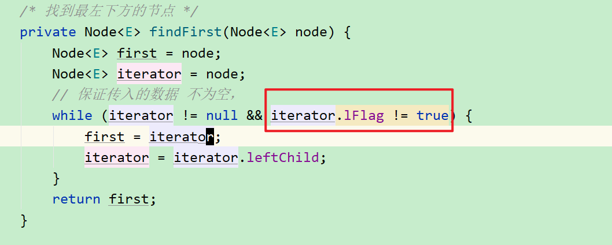
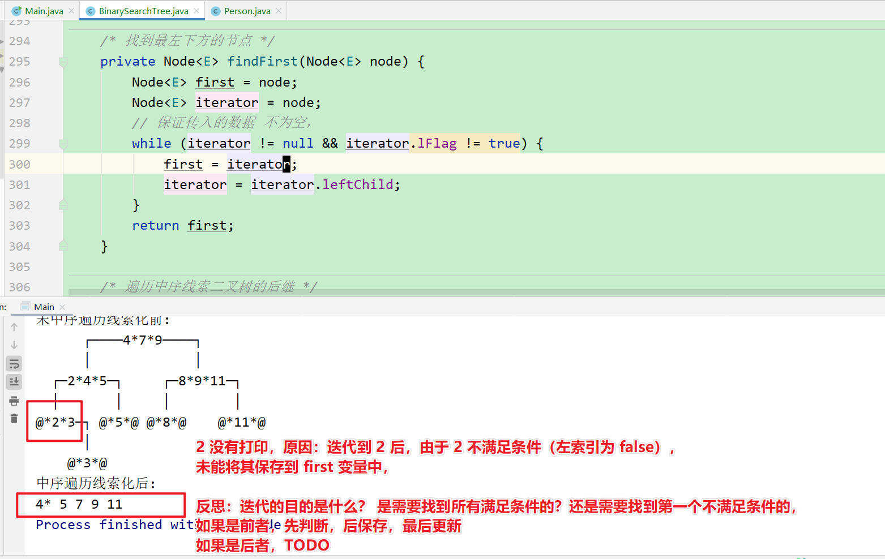
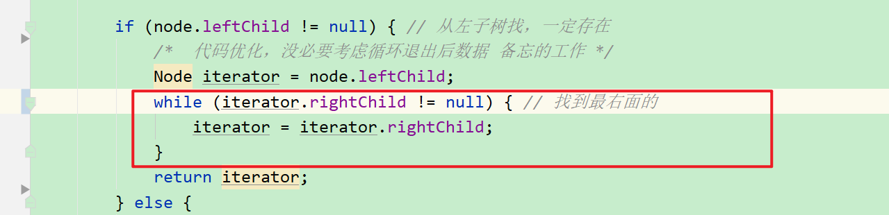
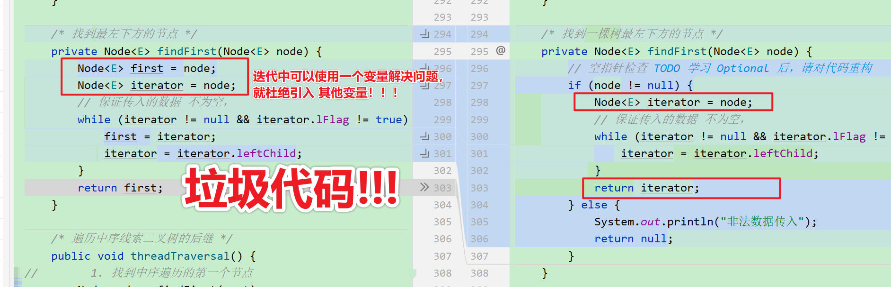
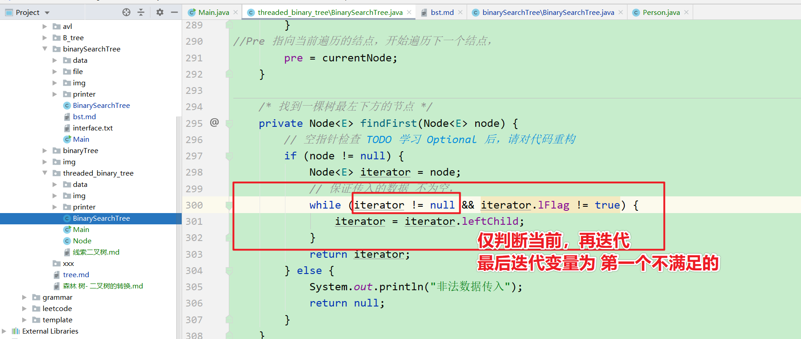
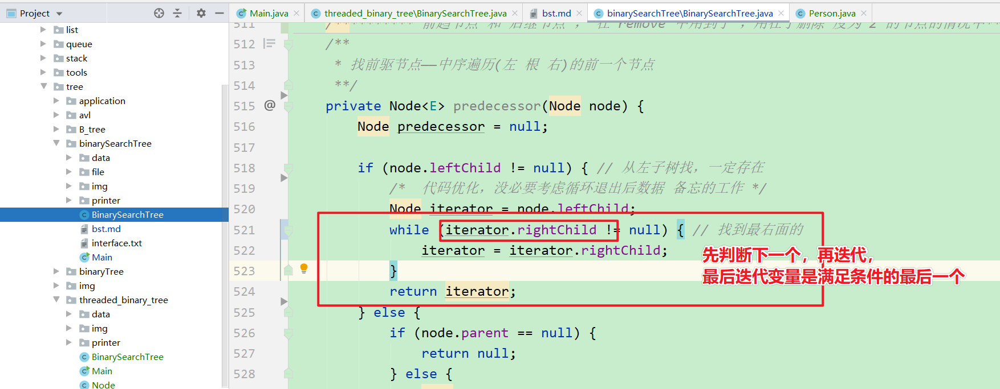

# 线索二叉树

## 编辑说明

在原来二叉树的基础上
仅保留需要的代码：

1. 打印功能
2. 用户可以自定义遍历元素处理逻辑的 4 种遍历
3. 添加节点功能

变化：

1. 遍历的 行为参数——函数式接口的唯一	方法visit 接收节点Node类型，而不是值
2. 由于用户需要访问节点 Node，因此 Node 应该作为一个 public 类，而不是私有类。
3. 为了区分 左右孩子和线索，设置两个标志位，Lflag, Rflag 分别标志左右索引是否设置

## 目标：要实现的2个功能

1. 中序遍历的过程中，对节点的空指针填入前驱或后继，构造线索二叉树。
2. 直接通过构造好的中序线索二叉树，输出中序遍历序列。

## 目标1 构造线索二叉树

### 要求

假设有 n 个节点，对 n+1 个空指针域 填充前驱和后继信息。

寻找前驱和后继不要用之前的代码，而是通过两个迭代指针来实现。

### 算法

注：Pre 指针  指向当前结点在中序遍历过程中的前一个结点。

1. 中序遍历到一个节点

2. 检查当前节点——左指针是否为 NULL，如果是，就设置前继索引，修改左指针为 Pre，并将当前节点的左索引标志位  置为 1，
   

   检查前一个节点—— Pre 是否存在,且右指针是否为 NULL，如果是，则设置后继索引，修改右指针为 当前指针，并将 其右索引位置为   1， 

   Pre 指向当前遍历的结点，开始遍历下一个结点，

### 实现

遇到的问题：内部类和lambda 访问的变量需要时 final 关键字修饰的

暂时解决

把 visit 方法写死在  BinarySearchTree 的遍历中，以后再思考上面问题如何解决 TODO

## 目标 2 ：通过构造好的中序线索二叉树，输出中序遍历序列

### 要求

通过节点中隐含的 前驱和后继信息，对其进行相应的遍历（中序遍历建立的，就输出中序遍历序列）

### 算法

1. 找到中序遍历的第一个节点
2. 检查 rflag 索引位是否存在，若存在，则后继为 右孩子指向的内容；
   如果不存在，则一定有右子树，选择右子树最左面的元素（第一个访问的元素）作为后继。
3. 后续节点重复 2 ，直到节点的右子树为 null（没有后继了）

### 实现

问题记录——爱的魔力转圈圈

原因推测：爱的魔力转圈圈

转圈问题

改正

改正之后还有问题：——迭代变量保存错误，没有达成目的——要迭代到第一个不满足条件的。

之前也遇到过类似的问题。——中序遍历寻找前驱节点的时候，从左子树找到最右面的节点。

当时的代码

反思通过 while 遍历寻找满足条件的元素的过程

1. 注意，从 while 出来的 **迭代变量** 是第一个不满足条件时的值。

2. 这个 **异类** 可能正是你想要的结果。

3. 思考：如果要得到第一个不满足条件的，怎么实现？

   > 初始值成立，先判断当前的，再迭代

   

4. 思考：如果要得到最后一个满足条件的，怎么实现？

   > 初始值成立，先判断当前的下一个，再迭代

   

   