# Stream


## 理解几个关键概念

中间操作时**惰性**的，只有用户指定了需要计算的时候才去计算。

中间操作还分状态，即是否要等前面的操作，如果不需要等，就是**短路**状态的操作。

## 数据处理

### 表——中间操作和终端操作汇总

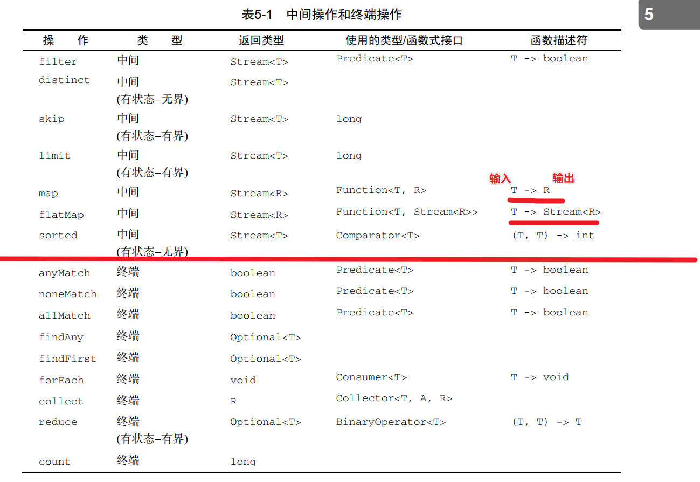

### 从数据源构建 Stream TODO

### 数据普通操作

| 操作            | 方法 |
| --------------- | ---- |
| 过滤            |      |
| 去重            |      |
| 限制个数        |      |
| 忽略前 n 个元素 |      |

 去重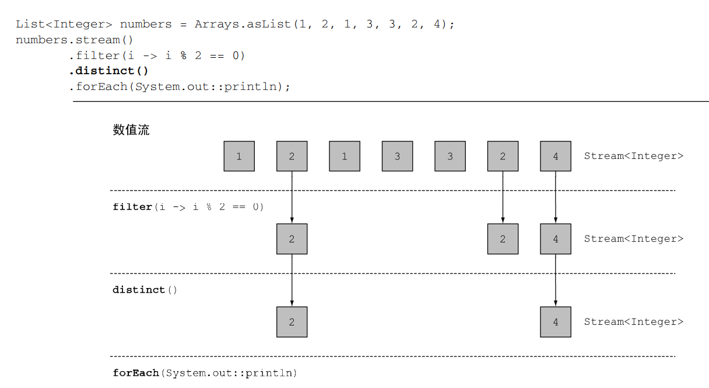

截断

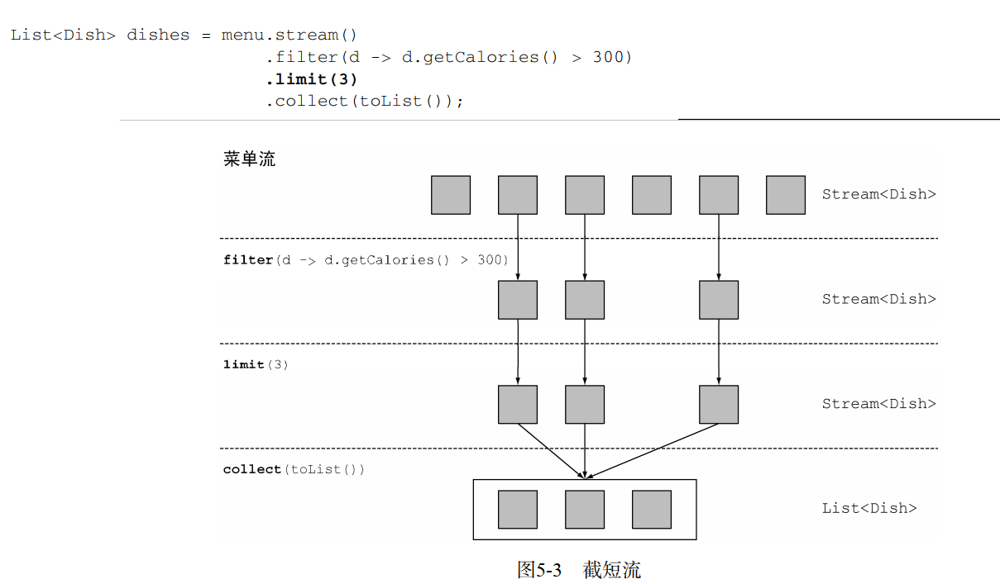

跳过

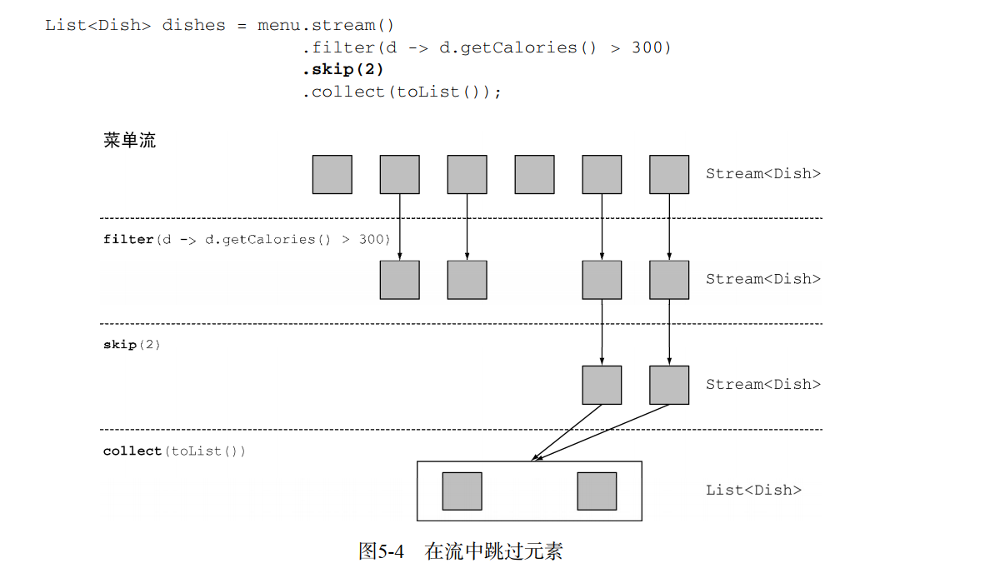

### 映射★★★批量加工操作 map 

#### 理解

##### map 原型

```java
<R> Stream<R> map(Function<? super T, ? extends R> mapper);
```

说明：Function 函数式接口 是用来转换处理数据的。

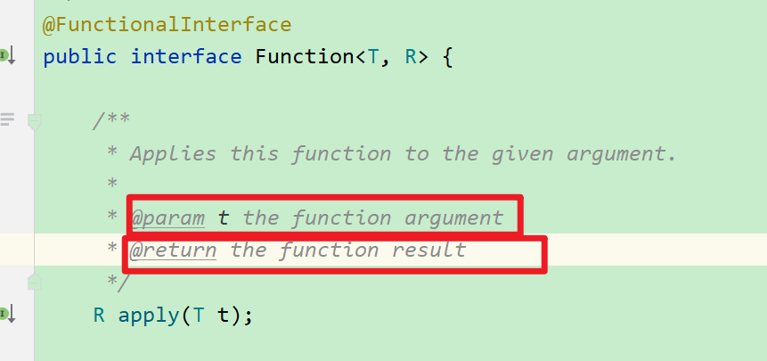

map 操作的是流中的元素，接收的参数类型是——元素的处理方法，需要有返回值，对元素进行加工

##### 参数（函数式接口）的 2 种 写法

###### 写法 1 lambda 表达式  ()->{}   

> 如果只有一行计算，默认是返回值，如果是多行，必须明确表明返回值

只有一条计算语句时：

```java
List<Integer> words = Arrays.asList(1, 2, 3, 4, 5);

List<Integer> squareOfwords = words.stream()
    .map(x->x*x)   // lambda 表达式，默认要遵守 有参数，有返回值的写法，对数据加工
    .collect(Collectors.toList());
System.out.println(squareOfwords.toString());
```

有多条语句时：

```java
List<Integer> words = Arrays.asList(1, 2, 3, 4, 5);

List<Integer> squareOfwords = words.stream()
    .map((x) -> {
        System.out.println("map 方法里必须要有返回值,默认只有运算时，不需要写返回值，如果有多行，则必须写 return");
        return x * x; // 多条语句，必须写 return
    })
    .collect(Collectors.toList());
System.out.println(squareOfwords.toString());

```


###### 写法2 方法引用的写法   （理解：元素是什么类型的，就可以使用类型相应的处理数据的方法）

局限性：

1. 如果方法有参数，不能使用  

比如：String 类型 的拆分方法，split ,要求显式指定拆分标志

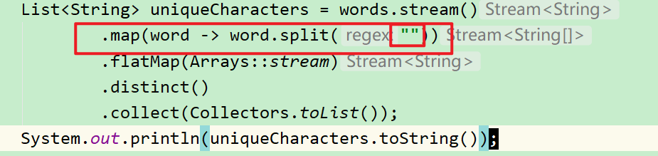

2. 如果有同名方法，不可以使用

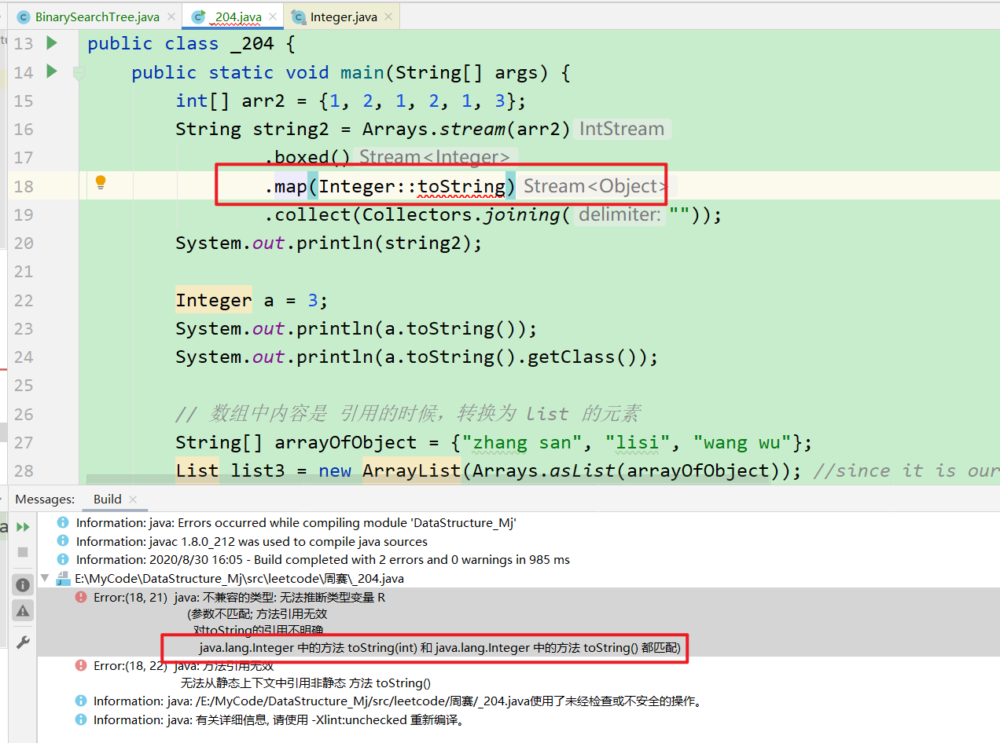

为什么？TODO （说明 map 的匹配原理）

解决方式

1. 解决方式 1

   用 lambda 表达式明确指定使用的哪一种方法

   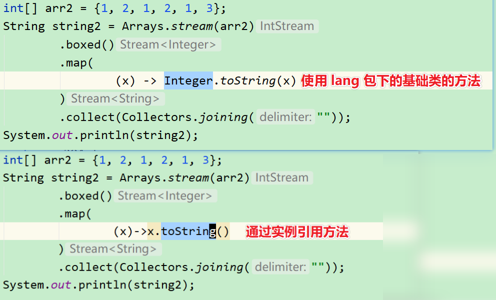

   

2. 解决方式 2

   使用 父类 Object 的 toString 方法（这也告诉我们，Stream 流中的类型可以使用父类的方法）

   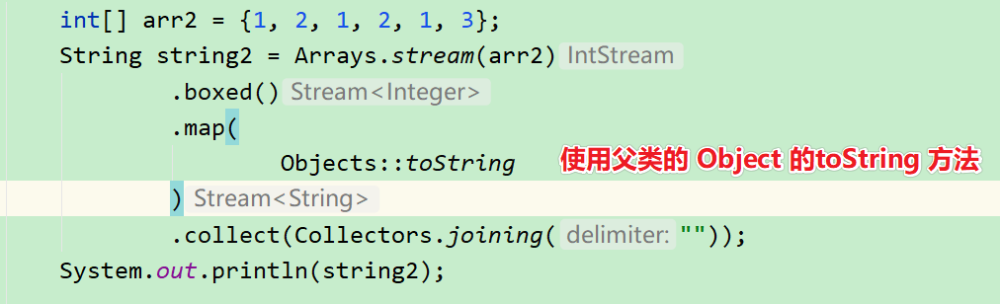

   


```java
List<Integer> words = Arrays.asList(1, 2, 3, 4, 5);

List<Integer> squareOfwords = words.stream()
    .map(Math::abs) // 方法引用，更加直观
    .collect(Collectors.toList());
System.out.println(squareOfwords.toString());
```


#### 案例 1 注意map 的局限性——引出 flatMap，将流中的数组扁平化为同等公民


注意一个问题：就是 流的加工，map 后，可能变为多个

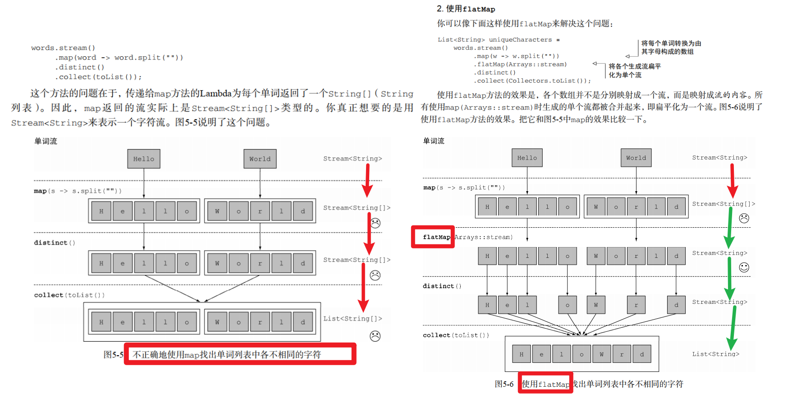

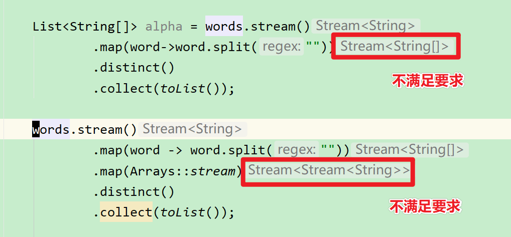

使用 map 后，再使用flatmap

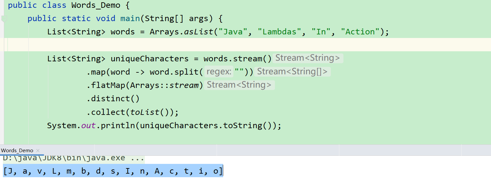

##### flatmap 原型

```java
<R> Stream<R> flatMap(Function<? super T, ? extends Stream<? extends R>> mapper);
```

解释

说明

flatMap 一次仅把一个维度的数组扁平化。

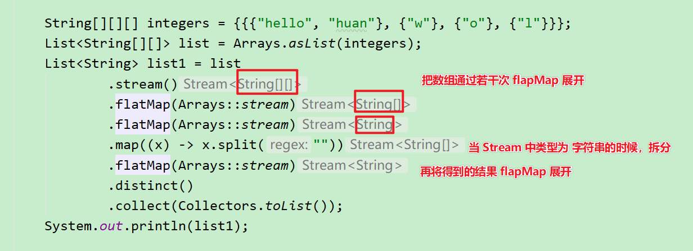


### 规约为一个值 reduce

### 规约——收集器 

