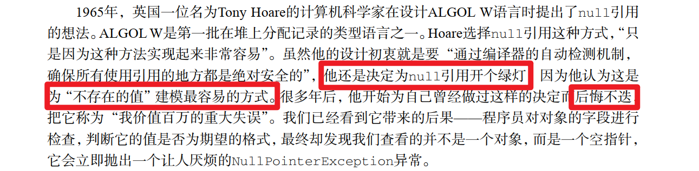
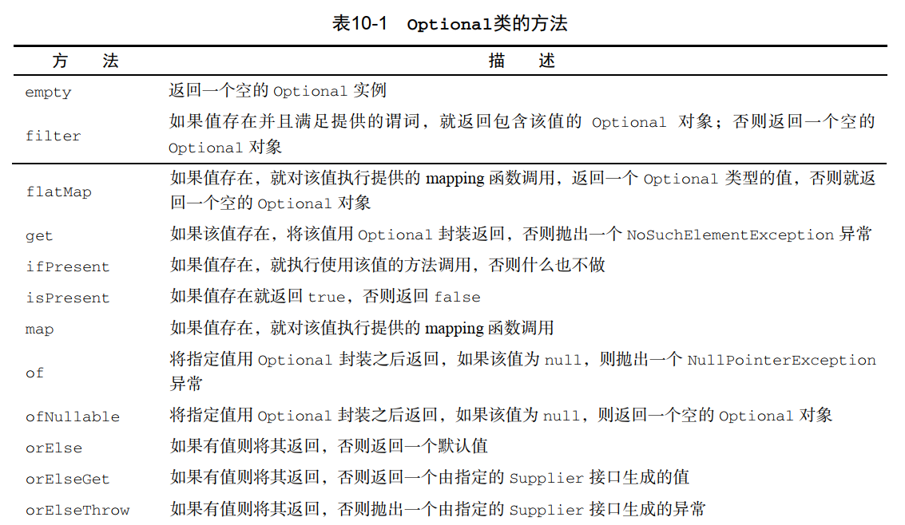

# Optional 学习笔记

## 实战


## 思考

### 历史



### 思想 

如何为缺失的值建模  ？

为什么用一种表示值缺失的形式(Optional)替换另一种（null）能帮助我们更好地编写程序？  

> 使用 Optional 而不是 null 的一个非常重要而又实际的语义区别是，第一个例子中，我们在声明变量时使用的是 Optional<Car> 类型，而不是 Car 类型，这句声明非常清楚地表明了这  里发生变量缺失是允许的。
>
> 与此相反，使用 Car 这样的类型，可能将变量赋值为 null，这意味着你需要独立面对这些，你只能依赖你对业务模型的理解，判断一个 null 是否属于该变量的有效范畴。  
>
> 在你的代码中始终如一地使用 Optional，能非常清晰地界定出变量值的缺失是结构上的问题，还是你算法上的缺陷，抑或是你数据中的问题。
>
> 另外，我们还想特别强调，引入 Optional类的意图并非要消除每一个 null引用。与此相反，它的目标是帮助你更好地设计出普适的 API，让程序员看到方法签名，就能了解它是否接受一个 Optional的值。这种强制会让你更积极地将变量从 Optional中解包出来，直面缺失的变量值。  

## 语法

### 1 创建

```java

```


### 2 提取内容


## 接口设计



