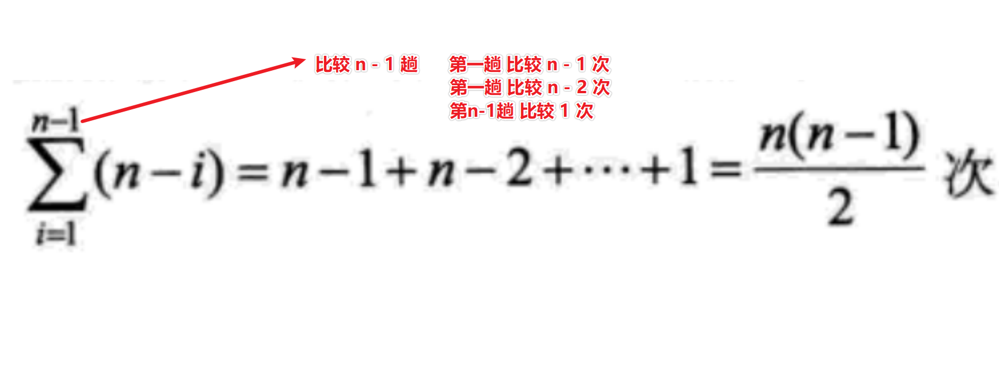

# 排序思想

## 希尔排序

key word : 跳跃式前移  考虑整个序列而不是局部有序

## 选择排序

从小到大排序时
① 假设当前元素是擂主，先从后续元素中先找到比他小的元素的位置，如果有，则交换两个位置的元素。确定第一轮比赛的冠军。
②判断下一个元素，重复 ①

### 分析

有 n 个元素比赛，共需 n - 1 场。

第一趟 比较 n - 1 次，
第二趟 比较 n - 2 次，
……
第 n-1 趟 比较 1 次

合计

代码分析

说明：代码中的第一个元素是从 下标 1 开始的

## 冒泡排序

