# 199 周赛

一周后再来！

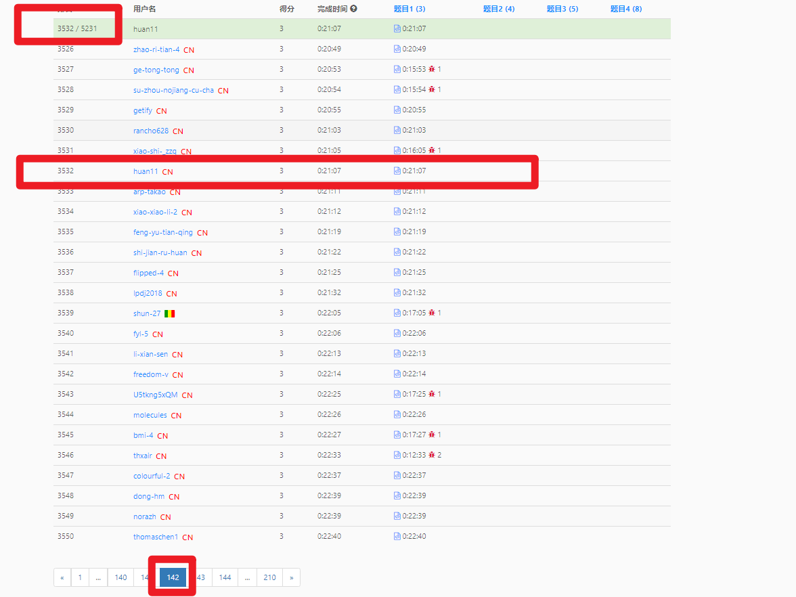

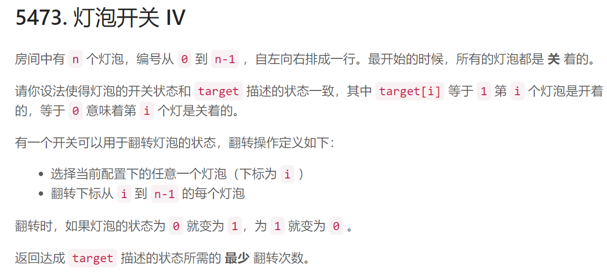

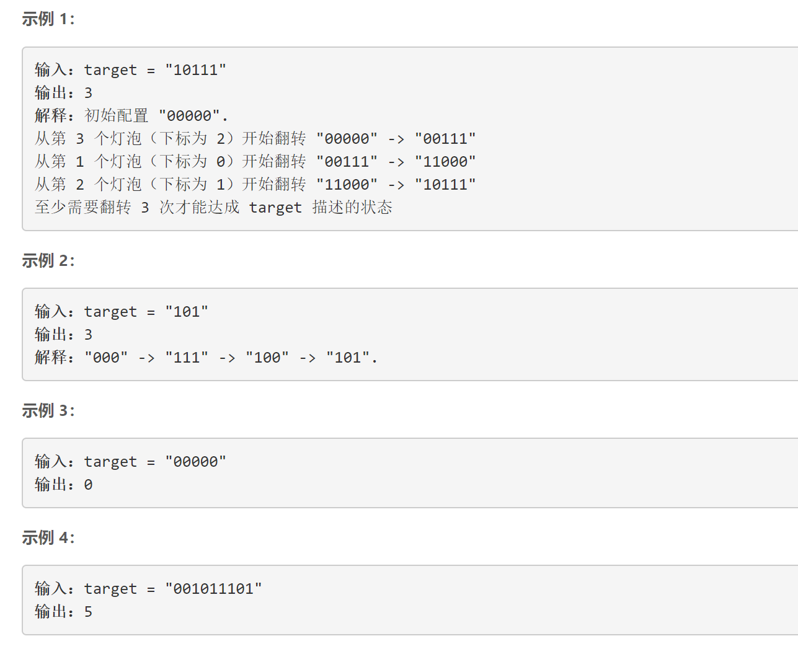

怎么反转？

还有哪些 0 1 的题，可以整理一下。

题解参考：

>https://www.bilibili.com/video/BV1Fk4y1m7z5


# 200 周赛

## 题目 1

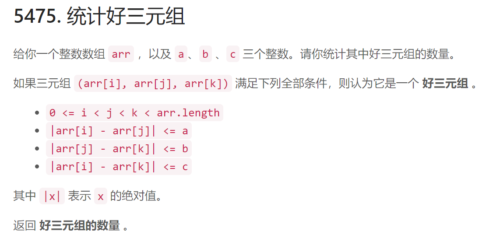

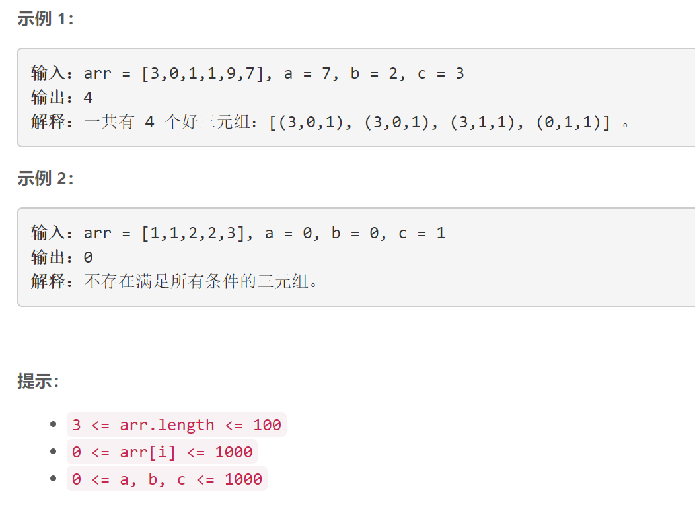

## 题目 2

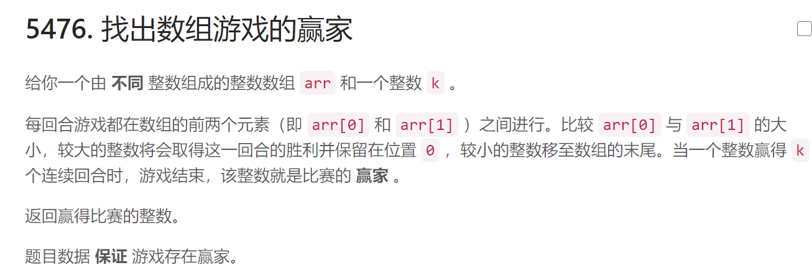

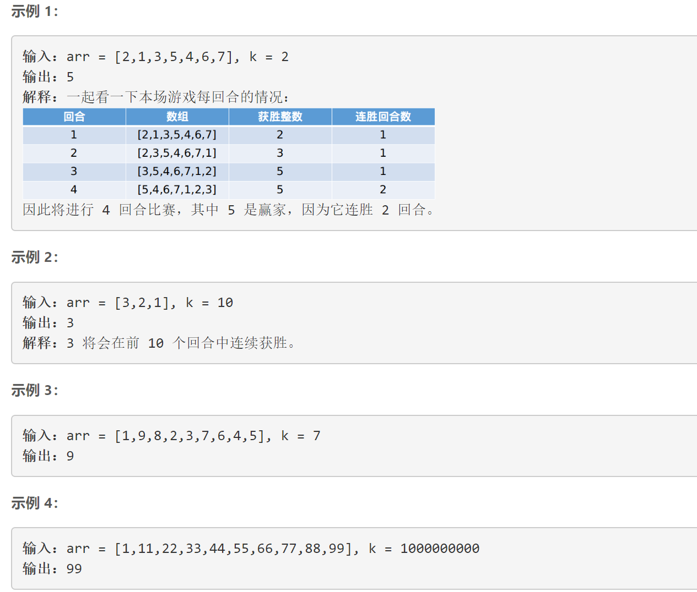

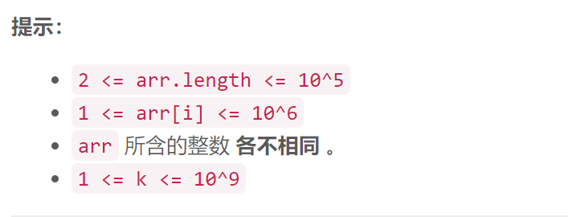


有一个变量记录擂主，如果更新擂主，count (连续获胜次数就 归 1)

但是超时了。

```java
public static int getWinner(int[] arr, int k) {
    int count = 0;
    int winter = arr[0];
    /* 先把数据模拟出来

           开始假设第一个元素是 擂主;
           然后将 擂主与下一个元素比较，
                如果比下一个元素大，擂主不变，将数据进行更新：失败者到队尾，其余元素前进;
                如果比下一个元素小，擂主更新为下一个元素新，将数据进行更新：失败者到队尾，其余元素前进。
         */
    while (count < k) {
        if (winter > arr[1]) {
            // 迭代变量
            count ++;
            // 更新数组
            int temp = arr[1];
            for (int i = 2; i < arr.length; i++) {
                arr[i-1] = arr[i];
            }
            arr[arr.length - 1] =temp;
        } else {
            // 更新擂主
            winter = arr[1];
            count = 1;

            //更新数组
            int temp = arr[0];
            for (int i = 1; i < arr.length ; i++) {
                arr[i-1] = arr[i];
            }
            arr[arr.length - 1] =temp;
        }
    }
    return arr[0];
}
```

可以注意到，其实输入的 k 到了某个值之后，结果就是固定了的。

```java
public  int getWinner(int[] arr, int k) {
    if (k >= arr.length){ // 找最大元素
        // 转换为 集合找到最大的元素，  如果是 java 8 以上版本
        List<Integer> list = Arrays
            .stream(arr)
            .boxed()
            .collect(Collectors.toList());
        return Collections.max(list);
    }
    
    
    
    int count = 0;
    int winter = arr[0];
    /* 先把数据模拟出来

           开始假设第一个元素是 擂主;
           然后将 擂主与下一个元素比较，
                如果比下一个元素大，擂主不变，将数据进行更新：失败者到队尾，其余元素前进;
                如果比下一个元素小，擂主更新为下一个元素新，将数据进行更新：失败者到队尾，其余元素前进。
         */
    while (count < k) {
        System.out.println(Arrays.toString(arr));
        if (winter > arr[1]) {
            // 迭代变量
            count ++;
            // 更新数组
            int temp = arr[1];
            for (int i = 2; i < arr.length; i++) {
                arr[i-1] = arr[i];
            }
            arr[arr.length - 1] =temp;
        } else {
            // 更新擂主
            winter = arr[1];
            count = 1;

            //更新数组
            int temp = arr[0];
            for (int i = 1; i < arr.length ; i++) {
                arr[i-1] = arr[i];
            }
            arr[arr.length - 1] =temp;
        }
    }
    return arr[0];
}
```

效果

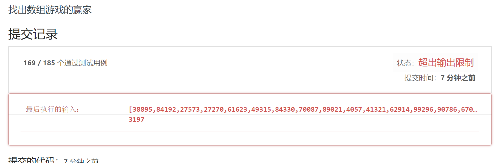

学习

> 链接：https://www.bilibili.com/video/BV1EK411n7ci


## 题目 3

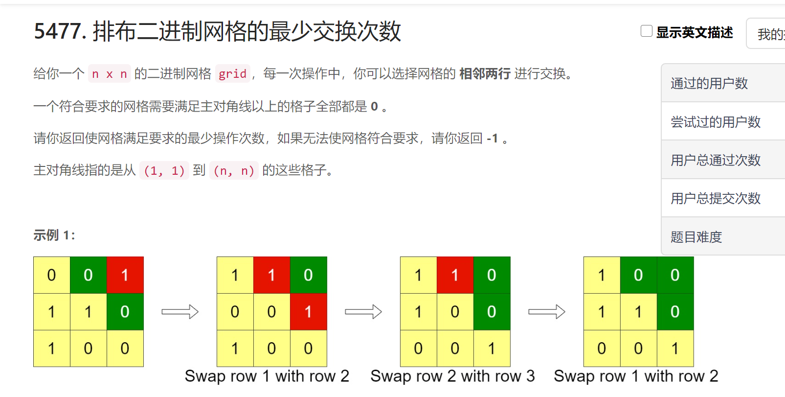

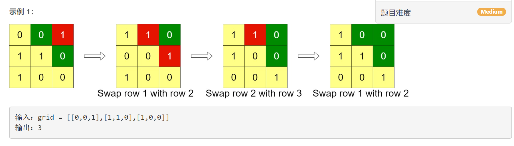

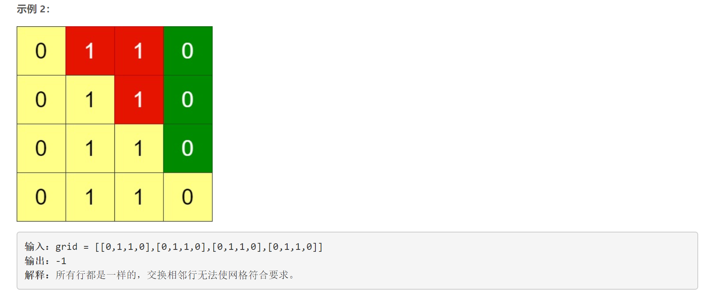

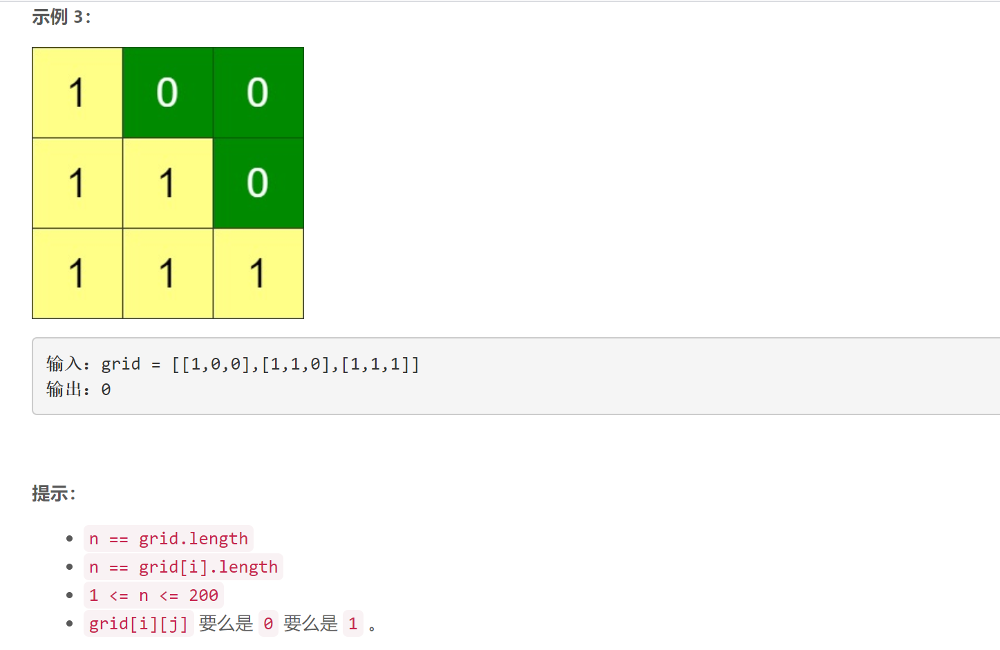

## 题目 4

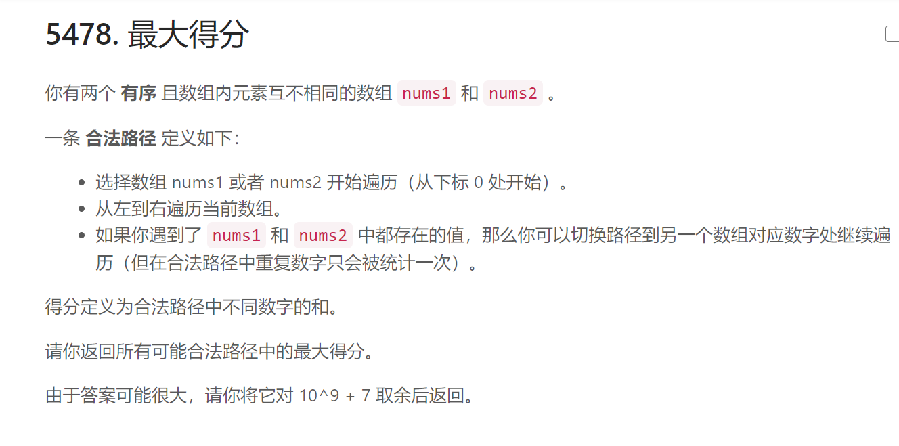

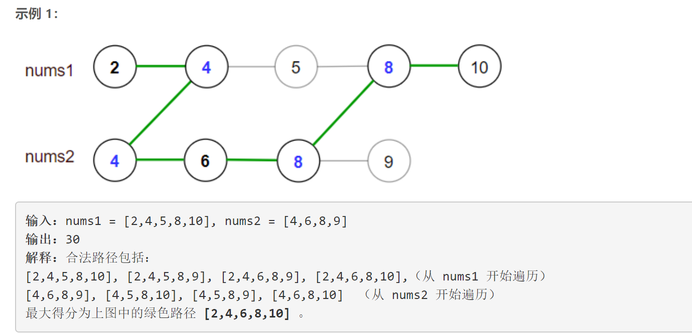

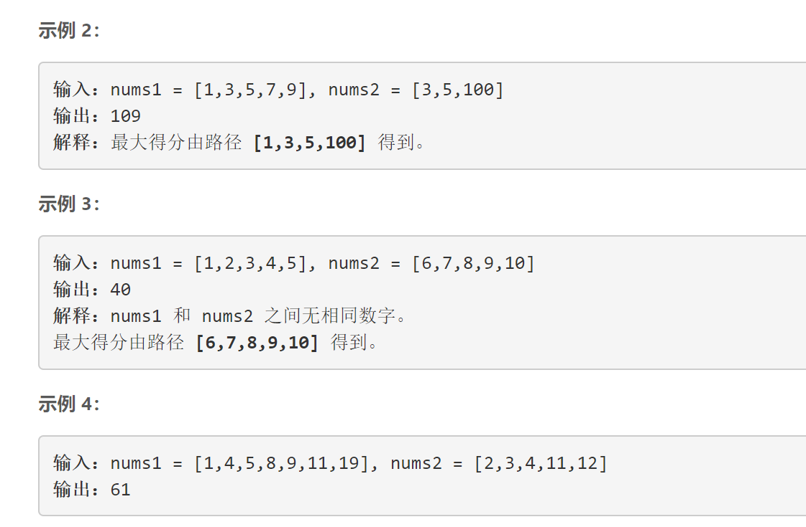

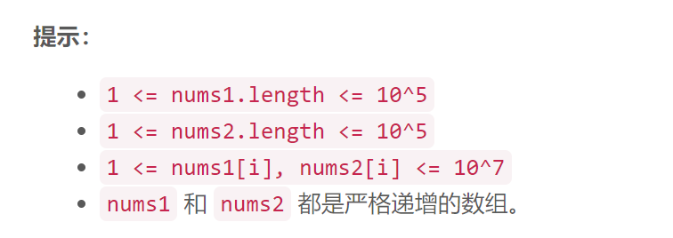

# 201周赛

## 题目1


## 题目2

## 题目3

## 题目4