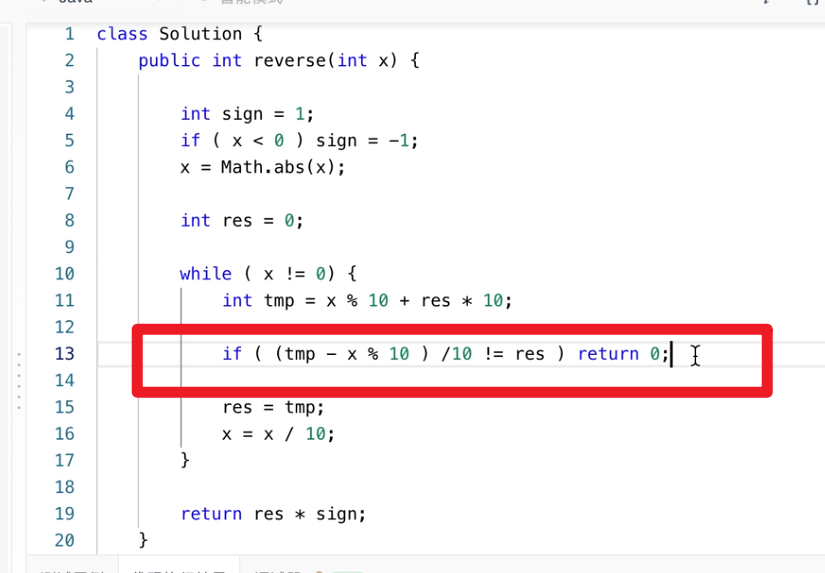

# 反转问题

## 反转字符串

思路 1 

## 反转整数

思路 1 ——计算的方法

> 思路：
>
> > 逐个取出最后一位，然后每次在个位填充。
>
> 如何取最后一位 ?
>
> > 取模  %
>
> 如何在各位填充?
>
> > 将之前的数进位
> >
> > 加上现在各位的数
>
> 注意事项——越界问题
>
> > 说明
> >
> > > 原来较小的数，反转后，可能直接就越界了。

参考：

https://www.bilibili.com/video/BV1654y1D7u1

