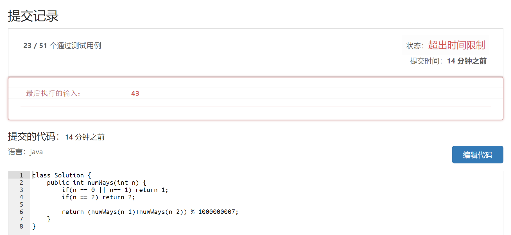
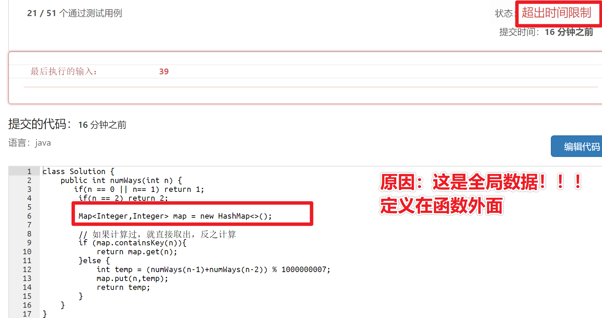

# 递归

## 实战

### 1 剑指 Offer 10- II. 青蛙跳台阶问题

>一只青蛙一次可以跳上1级台阶，也可以跳上2级台阶。求该青蛙跳上一个 `n` 级的台阶总共有多少种跳法。

#### 思路

* 实现方式一——递归

  >逆着思考问题，从最后一阶 n 开始想 ，跳到最后一阶的情况有 2 种，一步跳过来，两步跳过来。
  >
  >然后思考递归边界。
  >
  >TODO 如何解释 递归边界是 0 的情况？

* 改进——用 map/ 数组 存储中间结果

* 实现方式二——动态规划 TODO

  > 

问题报告——超时



原因——有大量重复计算

解决措施——提示关键词——使用map 存储计算过的结果

低级错误



使用 记忆中间计算结果的最终代码

```java
Map<Integer,Integer> map = new HashMap<>();

public int numWays(int n) {
    if(n == 0 || n== 1) return 1;
    if(n == 2) return 2;

    // 如果计算过，就直接取出，反之计算
    if (map.containsKey(n)){
        return map.get(n);
    }else {
        int temp = (numWays(n-1)+numWays(n-2)) % 1000000007;
        map.put(n,temp);
        return temp;	
    }
}
```

### 2 汉诺塔问题

#### 思路

> 将 A 划分为 两部分，最下面的一个 N 为 一部分，上面其余的1~N-1为一部分 ，问题等价于:
>
> > A上面的 1~N -1，A->B   C 为辅助盘
> >
> > A 上面的 N，A->C
> >
> > B 上面的 1~N -1，B->C  A 为辅助盘
>
> 注：划分很重要,经过一次移动，最大的盘到达目的地，且新的局面与原来相似 —— 即划分后的问题性质不改变，如果划分不恰当，后序移动无法进行。

独立思考及实现

> 为什么可以借助递归实现？问题的特征是什么？
>
> > 一次划分并移动后的子问题（1~N -1 规模为  N-1）的求解方法（局面不改变，问题条件不破坏（有两个空柱），问题性质不变，仅仅是规模减小）
> >
> > 原问题可以化解为子问题，子问题又可化解为子问题，最终可以解决的最小问题是——问题规模只有 1，无需再划分问题，可直接操作，直接移动到目标盘。
>
> 递归解决问题的特点是什么？
>
> >求解问题上
> >
> >1. 问题可划分为重复子问题
> >
> >形式上
> >
> >1. 深度优先搜索，一条巷子走到深
> >2. 
>
> 递归处理问题的一般套路是什么？TODO
>
> > 回顾递归的例子
> >
> > 1. 爬楼梯
> >
> >    > 
> >
> > 2. 斐波那契数列
> >
> >    >
> >
> > 3. 二叉树的前序，中序，后序遍历
> >
> >    > 
> >
> > 4. 汉诺塔问题
> >
> >    > ```java
> >    > private void hanota(int problemScale,List<Integer> A, List<Integer> B, List<Integer> C) {
> >    >     if (problemScale == 1){
> >    >         // 直接 A->C
> >    >         C.add(A.remove(0));
> >    >         return;
> >    >     }
> >    >     // 将 A 划分为 两部分，最下面的那个为 一部分，上面其余的为一部分, B 作为 辅助盘， C 为目标盘,整体思考问题
> >    >     // (划分很重要,经过一次移动，最大的盘到达目的地，且新的局面与原来相似 —— 即划分后的问题性质不改变，如果划分不恰当，后序无法移动)
> >    >     // 1~N-1个盘 A->B  C 为辅助
> >    >     hanota(problemScale - 1,A,C,B);
> >    >     // 第 N 个盘 ，A->C
> >    >     C.add(A.remove(0));
> >    >     // 1-N-1 个盘，B->C  A 为辅助
> >    >     hanota(problemScale - 1,B,A,C);
> >    > }
> >    > ```
> >
> > 5. 
>
> 怎么用递归套路实现？算法是什么？
>
> > 1. 用 N 表示问题规模
> >
> > 2. 先用自然+符号语言一句话（量化为 N + 源头是 A,目的地是 C,借助的是 B）将 N 个盘 的问题描述出来——借助 B 将 A 上的盘子移动到 C盘。（递归调用要完成的总任务，也就是递归调用的接口形式）
> >
> > 3. 描述问题如何划分为新的子问题（问题规模是 N-1，将规模为 N 的看作两部分来完成——①1 +② N-1，先处理 N-1, 再处理 1）
> >
> >    > 对 N- 1 部分怎么处理？
> >    >
> >    > 对 1 部分怎么处理？
> >
> > 4. 描述子问题如何处理
> >
> >    > 
> >
> >    