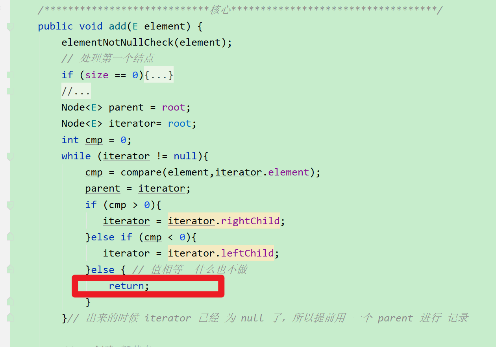

#  BinarySearchTree

## 编辑说明
1 复制 txt 未实现的接口
2 设计 ADT
3 实现 节点的比较函数 compare —— 使用 Comparator 结合 Comparable 
4 设计 打印二叉树的功能——实现 print 工具中的 BinaryTreeInfo 接口 的四个函数
5 

## ADT
### 数据类型
```java

```
### 操作

#### 编辑顺序

1. 考虑传入元素为 null ,编写 elementNotNullCheck(),不允许节点为null

2. 实现 add()

    1. 既然添加元素 ，先 size ++

    2. 先添加第一个节点—— root

        > 思路：
        >
        > root 节点的值为 参数值，root 没有 父节点
    
    3. 添加其他节点
    
        > 思路：
        >
        > 1  先找到他 所属的父节点
        >
        > > 思路：
        > >
        > > 遍历树的结点，和已有的树的节点的值进行比较 ，通过比较记录往什么方向插入节点，同时记录父节点
        > >
        > > ——需要实现  节点值比较的函数，compare 先暂留 当作函数调用，把主要逻辑弄完，一会在再写
        >
        > 2  创建 节点
        >
        > 3 和父节点建立 父子 关系
        >
        > (编写的时候的，需要数据结构是由 后面的内容确定的，所以代码不是从上往下写的——读代码的时候要注意这个问题，先找核心逻辑，再分析数据)

## 细节处理

遍历节点的时候遇到相同值的元素怎么处理？

