#  BinarySearchTree

## 编辑说明
1 复制 txt 未实现的接口

2 设计 ADT

3 实现 节点的比较函数 compare —— 使用 Comparator 结合 Comparable 

4 设计 打印二叉树的功能——实现 print 工具中的 BinaryTreeInfo 接口 的四个函数

5 实现二叉树的 4 种遍历(树的遍历是可以通用！)

1. 前序 PreorderTraversal 
2. 中序 InorderTraversal
3. 后序 PostorderTraversal
4. 层序 LevelOrder Traversal

> 说明：对于每个方法，额外添加了一个 private 修饰的 (仅供内部使用的)有参的 同名方法，专门给无需传参 的 public接口 调用。

6 重构二叉树的遍历接口——目的是用户在每次遍历节点的时候，可以按照用户需求对节点处理（而不光光是打印节点那么死板）——使用到了类似 Comparator 的设计思想——面向接口编程（在要对数据进行处理的地方，使用接口的方法而不是具体的方法，通过接口的参数将数据传给用户，让用户对数据处理进行决策）

7 增强遍历接口，实现可以遍历到指定节点便终止程序的功能。

## ADT
### 数据类型
```java
public class BinarySearchTree<E> {
    private int size;
    private Node<E> root;

    private static class Node<E> {
        E element;
        Node parent; 
        Node leftChild;
        Node rightChild;
    }
}
```
### 操作

#### 编辑顺序

1. 考虑传入元素为 null ,编写 elementNotNullCheck(),不允许节点为null

2. 编写 add()

    1. 既然添加元素 ，先 size ++

    2. 先添加第一个节点—— root

        > 思路：
        >
        > root 节点的值为 参数值，root 没有 父节点

    3. 添加其他节点

        > 思路：
        >
        > 1  先找到他 所属的父节点
        >
        > > 思路：
        > >
        > > 遍历树的结点，和已有的树的节点的值进行比较 ，通过比较记录往什么方向插入节点，同时记录父节点
        > >
        > > ——需要实现  节点值比较的函数，compare 先暂留 当作函数调用，把主要逻辑弄完，一会在再写
        >
        > 2  创建 节点
        >
        > 3 和父节点建立 父子 关系
        >
        > (编写的时候的，需要数据结构是由 后面的内容确定的，所以代码不是从上往下写的——读代码的时候要注意这个问题，先找核心逻辑，再分析数据)

3. 实现通用的 遍历方法（所谓的“序”说的是根 ）

    1. 前序遍历(Preorder Traversal)
        优先根节点， 根——左——右
        
        实现方式，递归
        
    2. 中序遍历(Inorder Traversal)

        根排第二，     左——根——右

        > BST 的中序遍历后的结果 刚好是升序排序/降序排序的

    3. 后序遍历(Postorder Traversal)

        根排第三，     右——左——根

    4. 层序遍历(LevelOrder Traversal)

        > 提示：使用 队列的方式实现。
        >
        > 如何实现呢？（或者说算法步骤是什么？）
        >
        > 1 将根 root节点放到 队列
        >
        > 2 取出根节点
        >
        > 3 将 根的 left 和 right 分别放入队列
        >
        > 4 重复 2 -3 步骤
        >
        > 
        >
        > Java 的队列的相关知识：
        >
        > 队列 再 Java 中仅仅定义的是一个接口，实例化的时候，用 LinkedList 进行实例化。
        >
        > 
        >
        > 2 Queue 接口的方法名字有些特殊：
        >
        > > 1 enqueue（入队）—— offer
        >>
        > > 2 dequeue（出队）——  poll (削)
        > >
        > > 3 front（取队头） ——   peek
        > 
        > 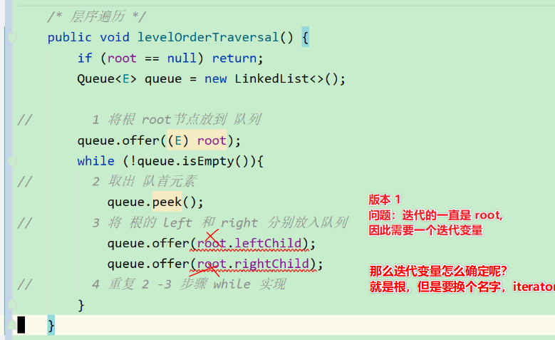
        >
        > 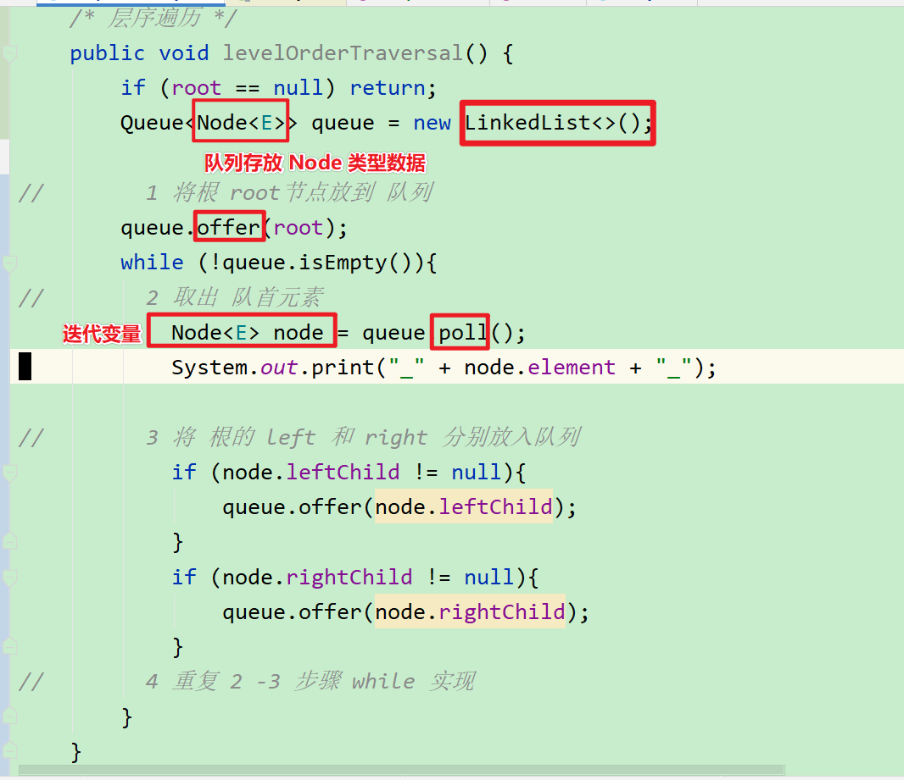

4. 重构遍历接口——用户自定义拿到遍历到每个节点后的处理逻辑

    原因：原来的代码，用户只能使用写死的处理节点逻辑，无法自定义节点处理逻辑。

    对比：

    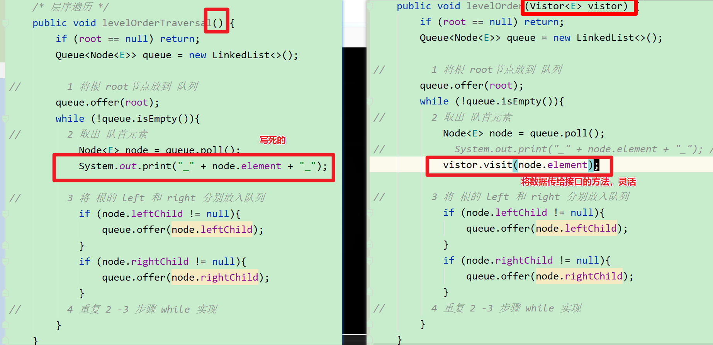

    

    > 面向接口编程
    >
    > 1 定义处理节点逻辑的接口（由于这个和二叉树关联比较大，直接在 二叉树内部定义接口 ）
    >
    > 接口方法，将数据作为参数，交给用户处理
    >
    > 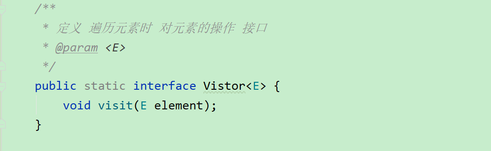
    >
    > 2 如何使用接口方法
    >
    > > 1 需要灵活处理的地方，使用接口方法，而不是具体的方法
    > >
    > > 2 用户 在使用方法的时候，具体实现接口方法
    > >
    > > 

5. 继续增强遍历接口——需求——不遍历所有节点，按需遍历到指定节点就终止

    1. 如果想遍历到某个元素就结束遍历，如何实现？

    > 问题明确：
    >
    > > 当发现指定元素后，后面的都不输出，最好直接终止程序。
    >
    > 具体分析：
    >
    > > 对于层序遍历（迭代实现），在通过 接口 进行操作元素的位置，对用户的输入进行判断，如果用户显式的将 接口的方法的 逻辑值  指定为 ture (java 默认返回 false)，就中断程序。
    > >
    > > 
    > >
    > > 要区分 2 个概念：
    > >
    > > ——1虽然表面不打印，但实际程序没终止（治标不治本）
    > >
    > > ——2 不光表面不打印，而且实际程序也终止了（标本兼治）
    > >
    > > 如果要标本兼治，就需要考虑如何终止递归，既要在递归终止条件处 下手。
    >
    > 
    >
    > 具体实现：
    >
    > 层序遍历（迭代实现）
    >
    > >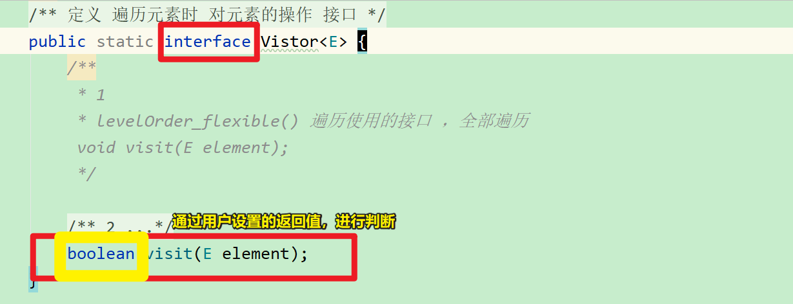
    > >
    > >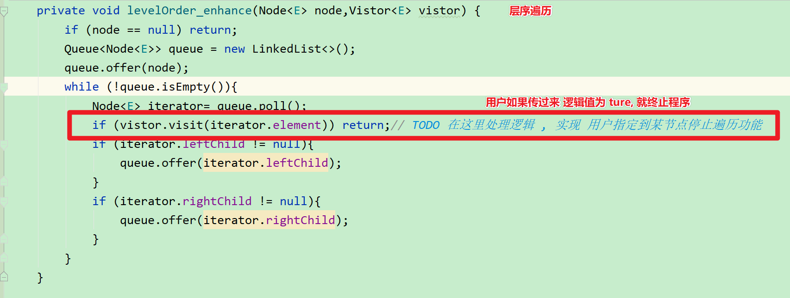
    >
    > 前中后序遍历（迭代实现）
    >
    > >对于前中后序（递归实现），是否可以使用像之前  层序遍历 那样的判断实现需求呢 ？
    > >
    > >先看解决方式 1：
    > >
    > >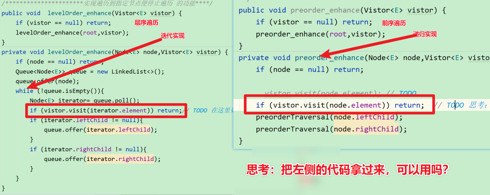
    > >
    > >问题：
    > >
    > >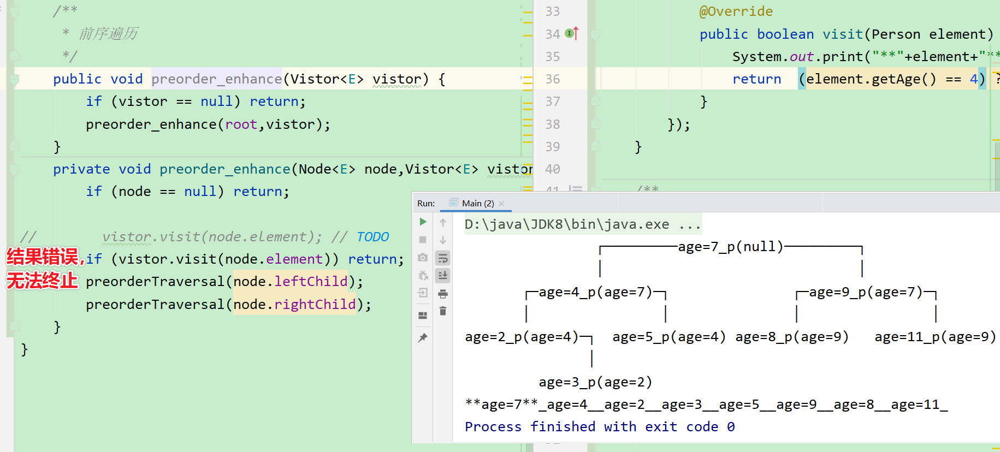
    > >
    > >思考 1  ：上述为什么不可以？
    > >
    > >> 你想，每次遍历使用的  vistit 方法返回的都是自己的 布尔值，不是全局共用的，自然，上次的设置或者说修改对下次是不可见的。我们的目的是能记录上次的状态！因此需要一个可以共用的数据。
    > >
    > >
    > >
    > >思考 2 ：如何将 上次的  boolean 值保存起来？
    > >
    > >> 思路  1
    > >>
    > >> 在方法外面额外定义一个全局变量吗？
    > >>
    > >> 那有  4  个遍历方法，岂不是要定义 4 个变量？
    > >>
    > >> 不可行。
    > >>
    > >> 
    > >>
    > >> 思路  2
    > >>
    > >> 一次递归中，所有子递归都不断往下传一个相同的数据——Vistor,因此可以在这个数据上动手脚。
    > >>
    > >> 
    > >>
    > >> 能否直接在 接口 Vistor 中定义一个 成员变量呢？
    > >>
    > >> 不能，按照 Java 语法：
    > >>
    > >> ——接口中可以定义成员变量，
    > >>
    > >> 但是，默认修饰符 **public static final**  ，
    > >>
    > >>  final 的含义是—— 只可赋值一次。
    > >>
    > >> 因此不满足要求，
    > >>
    > >> 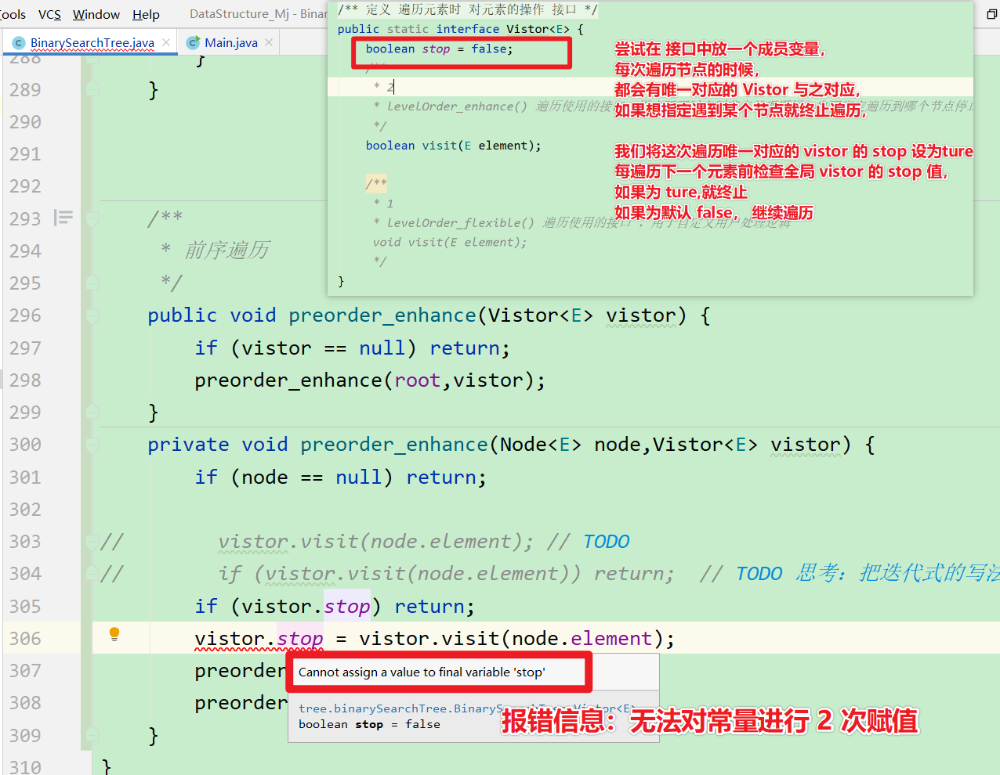
    > >>
    > >> 因此，不可行。
    > >>
    > >> 
    > >>
    > >> 思路 3
    > >>
    > >> 既然，接口不行，那就用 和接口类似的，但是可以存放**可修改的**成员变量的 抽象类
    > >>
    > >> 
    > >>
    > >> > 问题：
    > >> >
    > >> > 对于前序遍历，判断出现在前面，如果一旦出现 值为 true ，后续递归就终止执行。
    > >> >
    > >> > 
    > >> >
    > >> > 但是，对于后续或者是中序遍历，只是终止了打印逻辑，并没有终止后续所有的递归。
    > >> >
    > >> > 配图：
    > >> >
    > >> > 
    > >> >
    > >> > 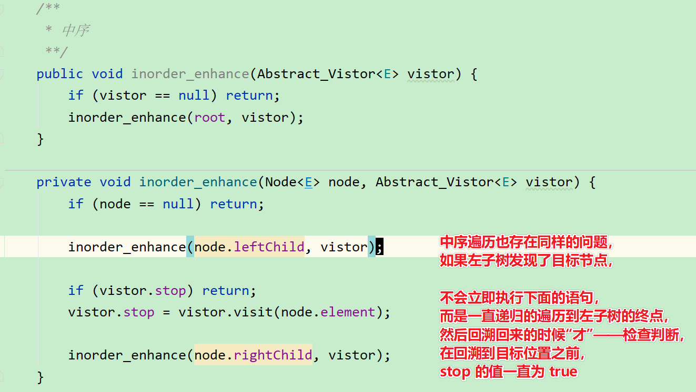
    > >> >
    > >> > 
    > >> >
    > >> > 解决方式:在递归的终止条件处做文章
    > >> >
    > >> > 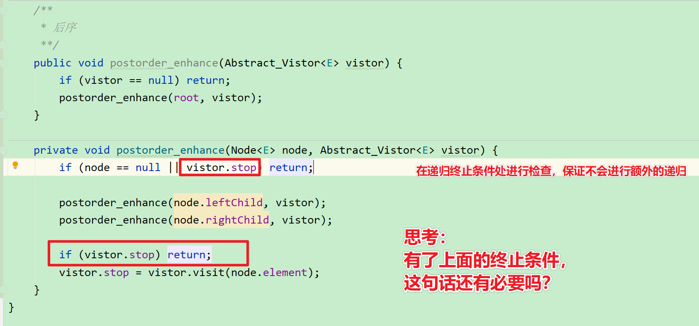
    > >> >
    > >> > > 思考答案：
    > >> > >
    > >> > > 有必要。
    > >> > >
    > >> > > 原因：上面的那句检查代码的作用是负责终止后续节点的递归。
    > >> > >
    > >> > > 可以这样想，如果没有下面的语句会怎样？——如果没有，假设找到了目标节点，下次调用递归的时候，会直接终止返回，然后执行下面的语句，如果这里没有语句进行控制，那么，就会遍历当前的节点，导致输出多了当前目标节点。
    > >> > >
    > >> > > 
    > >> > >
    > >> > > 启发：
    > >> > >
    > >> > > 如果我是单纯的想终止递归到某个节点（不包括该节点），直接在递归调用处做文章即可，

## 细节处理

遍历节点的时候遇到相同值的元素怎么处理？是选择什么也不做吗？这样有问题吗？


> 解决方法：使用覆盖的方式，原因，如果数据的属性不止一个，比如，Person 还有名字，如果添加了 两个 10 岁的Person ,但名字不一样，如果后面的是应该覆盖掉前面的，代码就要调整一下。

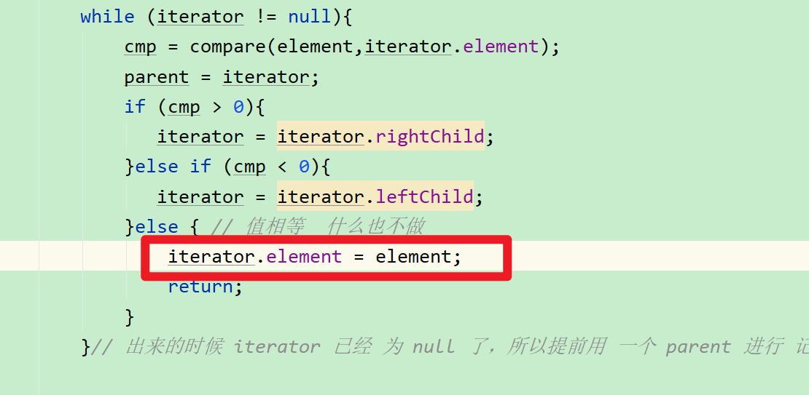

为什么对于遍历的方法，都要设计两个方法？一个 public , 一个 private ? 

> 别人的写法：
> 遍历 用到了root , public 方法将 root 作为实参 传给 private 方法
>
> 思考：
> 我完全可以 直接 将全局数据 root 不用传参的方式使用，就和 size() 方法一样，那为什么还要这样写呢？多此一举吗？ TODO


方法多了，别弄错了

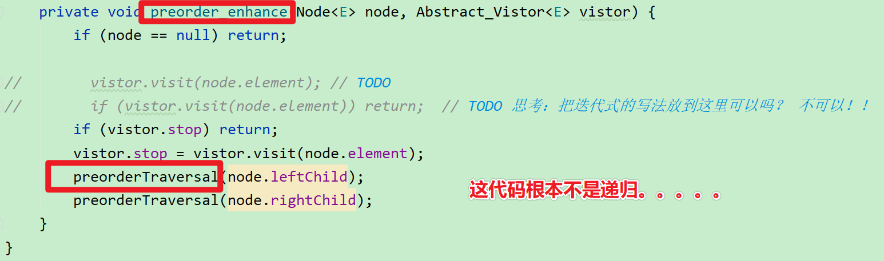

## 接口，命名说明（可能存在问题，比较仓促）

### 项目结构说明

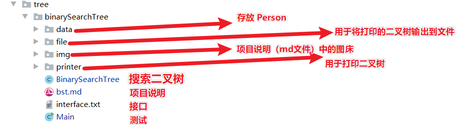

### BST 类型说明

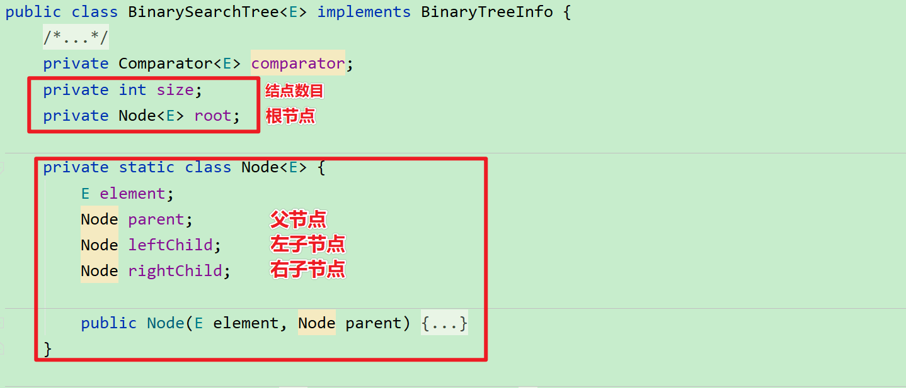

### 接口说明

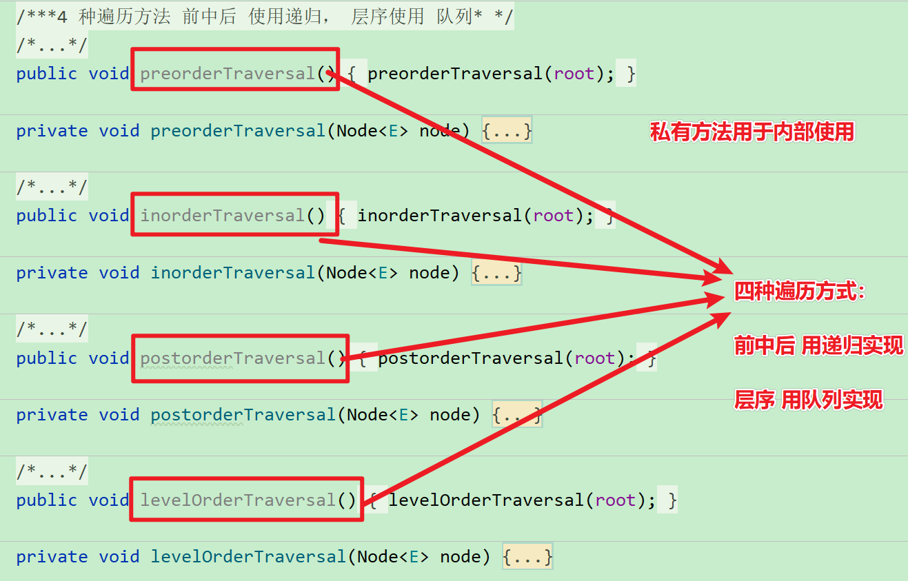

### 设计说明

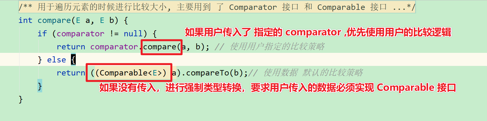